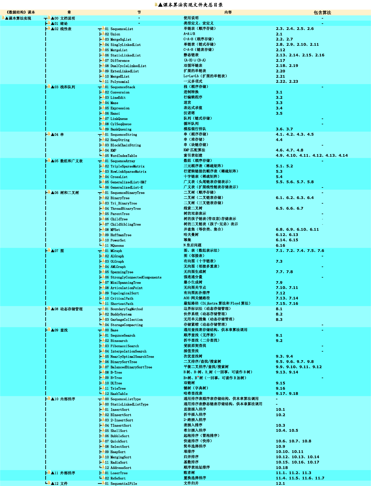

# 《数据结构》课本源码与习题解析

## 项目介绍

本项目与教材《数据结构-C语言版》（严蔚敏,吴伟民版）配套。    
很多同学后台私信需要源码，故干脆将此项目上传到了github。    

## 使用说明

* 开箱即用。克隆/下载到本地后，使用[C-Free 5](http://www.programarts.com/cfree_ch/)打开即可运行（此处不要创建工程，直接打开main文件编译运行）。    
* 更详细的使用说明参见：[《数据结构-C语言版》（严蔚敏,吴伟民版）课本源码+习题集解析使用说明](https://www.cnblogs.com/kangjianwei101/p/5221816.html) 。    
* 如果CFree在win10上遇到兼容问题，可尝试使用 **Dev-C++**（注意，在此项目上使用Dev-C++时，不要创建工程，而是直接将main文件打开后编译运行）。    

## 注意事项

1. **仅限个人学习使用**    
2. **别抄作业**    
3. 鼓励在Github提交反馈    

## Commit图例

| 序号 |   emoji    |           在本项目中的含义           |   简写标记    |
| ---- | ---------- | ---------------------------------- | ------------ |
| (0) | :tada:     | 初始化项目                          | `:tada:`     |
| (1) | :memo:     | 更新文档，包括但不限于README         | `:memo:`     |
| (2) | :bulb:     | 发布新的源码                        | `:bulb:`     |
| (3) | :sparkles: | 增量更新源码                        | `:sparkles:` |
| (4) | :recycle:  | 重构，主要指修改已有的源码与注释      | `:recycle:`  |
| (5) | :pencil2:  | 校对，主要指更正错别字、修改源码排版等 | `:pencil2:`  |
| (6) | :bug:      | 修复代码中的BUG                     | `:bug:`      |

## 相关链接

[个人博客](http://www.cnblogs.com/kangjianwei101)    

## 脚注

Commit信息中的`emoji`参考来源：    

* [Full Emoji List](https://unicode.org/emoji/charts/full-emoji-list.html)    
* [gitmoji](https://gitmoji.carloscuesta.me/)    

## 附：源码目录

 
