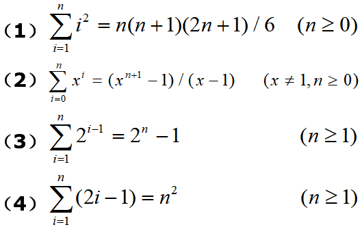
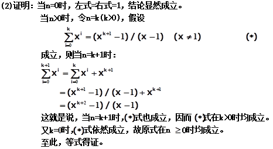

# 第1章 绪论

## 一、基础知识题

### 1.1 简述下列术语：数据、数据元素、数据对象、数据结构、存储结构、数据类型和抽象数据类型。

> **数据**(data)是对客观事物的符号表示。在计算机科学中是指所有能输入到计算机中并被计算机程序处理的符号的总称。
> **数据元素**(data element)是数据的基本单位，在计算机程序中通常作为一个整体进行考虑和处理。
> **数据对象**(data object)是性质相同的数据元素的集合，是数据的一个子集。
> **数据结构**(data structure)是相互之间存在一种或多种特定关系的数据元素的集合。
> **存储结构**（**物理结构**）是数据结构在计算机中的表示（又称映像）。
> **数据类型**(data type)是一个值的集合和定义在这个值集上的一组操作的总称。
> **抽象数据类型**(Abstract Data Type)是指一个数学模型以及定义在该模型上的一组操作。

### 1.2 试描述数据结构和抽象数据类型的概念与程序设计语言中数据类型概念的区别。

> 简单地说，数据结构定义了一组按某些关系结合在一起的数组元素。数据类型不仅定义了一组带结构的数据元素，而且还在其上定义了一组操作。

### 1.3 设有数据结构（D，R），其中：D={d1,d2,d3,d4}，R={r}，r={(d1,d2),(d2,d3),(d3,d4)}。试按图论中图的画法惯例画出其逻辑结构图。


### 1.4 试仿照三元组的抽象数据类型分别写出抽象数据类型复数和有理数的定义（有理数是其分子、分母均为自然数且分母不为零的分数）。

```c
复数定义：
ADT Complex  //复数定义 a±bi
{
    数据对象：D = {a, b | a,b为实数}
    数据关系：R = {<a, b>}
    基本操作：
        InitComplex(&C, re, im)
            操作结果：构造一个复数C，其实部和虚部分别为re和im
        DestroyCmoplex(&C)
            操作结果：销毁复数C
        Get(C, k, &e)
            初始条件：复数C已存在
            操作结果：用e返回复数C的第k元的值
        Put(&C, k, e)
            初始条件：复数C已存在
            操作结果：改变复数C的第k元的值为e
        IsAscending(C)
            初始条件：复数C已存在
            操作结果：如果复数C的两个元素按升序排列，则返回1，否则返回0
        IsDescending(C)
            初始条件：复数C已存在
            操作结果：如果复数C的两个元素按降序排列，则返回1，否则返回0
        Max(C, &e)
            初始条件：复数C已存在
            操作结果：用e返回复数C的两个元素中值较大的一个
        Min(C, &e)
            初始条件：复数C已存在
            操作结果：用e返回复数C的两个元素中值较小的一个
}ADT Complex

```

```c
有理数定义：
ADT RationalNumber  //有理数定义
{
    数据对象：D={s, m | s,m为自然数，且m不为0}
    数据关系：R={<s, m>}
    基本操作：
        InitRationalNumber(&R, s, m)
            操作结果：构造一个有理数R，其分子和分母分别为s和m
        DestroyRationalNumber(&R)
            操作结果：销毁有理数R
        Get(R, k, &e)
            初始条件：有理数R已存在
            操作结果：用e返回有理数R的第k元的值
        Put(&R, k, e)
            初始条件：有理数R已存在
            操作结果：改变有理数R的第k元的值为e
        IsAscending(R)
            初始条件：有理数R已存在
            操作结果：若有理数R的两个元素按升序排列，则返回1，否则返回0
        IsDescending(R)
            初始条件：有理数R已存在
            操作结果：若有理数R的两个元素按降序排列，则返回1，否则返回0
        Max(R, &e)
            初始条件：有理数R已存在
            操作结果：用e返回有理数R的两个元素中值较大的一个
        Min(R, &e)
            初始条件：有理数R已存在
            操作结果：用e返回有理数R的两个元素中值较小的一个
}ADT RationalNumber
```

### 1.5 	试画出与下列程序段等价的框图。

**(1)**

```c
product = 1; 
i = 1;
while(i<=n)
{
  product *= i;
  i++;
}
```


**(2)**

```c
i=0;
do
{
  i++;
}while((i!=n) && (a[i]!=x));
```


**(3)**

```c
switch
{
  case	x<y:
    z=y-x;
    break;
  case x==y:
    z=abs(x*y);
    break;
  default: 
    z=(x-y)/abs(x)*abs(y);
}
```


### 1.6 在程序设计中，常用下列三种不同的出错处理方式：
#### （1）用exit语句终止执行并报告错误；
#### （2）以函数的返回值区别正确返回或错误返回；
#### （3）设置一个整型变量的函数参数以区别正确返回或某种错误返回。
### 试讨论这三种方法各自的优缺点。

> （1）exit常用于严重错误处理，它可以强行中断程序的执行，返回操作系统。优点是可以在程序的任何地方关闭程序，缺点是隐藏了故障信息。
> （2）以函数的返回值判断正确与否常用于子程序的测试，便于实现程序的局部控制。
> （3）用整型变量进行错误处理的优点是可以给出错误类型，便于迅速定位错误。

### 1.7 在程序设计中，可采用下列三种方法实现输出和输入：
#### （1）通过scanf和printf语句；
#### （2）通过函数的参数显式传递；
#### （3）通过全局变量隐式传递。
### 试讨论这三种方法的优缺点。

> （1）用scanf和printf直接进行输入输出的好处是形象、直观，但缺点是需要对其进行格式控制，较为烦琐，如果出现错误，则会引起整个系统的崩溃。
> （2）通过函数的参数传递进行输入输出，便于实现信息的隐蔽，减少出错的可能。
> （3）通过全局变量的隐式传递进行输入输出最为方便，只需修改变量的值即可，但过多的全局变量使程序的维护较为困难。

### 1.8 设n为正整数。试确定下列各程序段中前置以记号@的语句的频度：

**（1）**

```c
i = 1; k = 0;
while(i <= n-1)
{
@ k += 10 * i;
  i++;
}
```

> n-1

**（2）**

```c
i = 1; k = 0;
do
{
@ k += 10 * i;
  i++;
}while(i <= n-1);
```

> n=1时，至少执行一次，即频度为1。n>1时，执行频度为 n-1。

**（3）**

```c
i = 1; k = 0;
while(i <= n-1)
{
  i++;
@ k += 10 * i;
}
```

> n-1

**（4）**

```c
k = 0;
for(i=1; i<=n; i++)
{
  for(j=i; j<=n; j++)
@   k++;
}
```

> 

**（5）**

```c
for(i=1; i<=n; i++)
  for(j=1; j<=i; j++)
    for(k=1; k<=j; k++)
@     x += 1;
```

> 

**（6）**

```c
i = 1; j = 0;
while(i+j <= n)
{
@ if(i>j)
    j++;
  else
    i++;
}
```

> n

**（7）**

```c
x = n; y = 0;  //n是不小于1的常数
while(x >= (y+1)*(y+1))
@ y++;
```

>  

**（8）**

```c
x = 91; y = 100;
while(y>0)
{
@ if(x>100)
  {
    x -= 10;
    y--;
  }
  else
    x++ ;
}
```

> 1100

### 1.9 假设n为2的乘幂，并且n>2,试求下列算法的时间复杂度及变量count的值（以n的函数形式表示）。

```c
int Time (int n)
{
  count = 0;
  x = 2;
  while(x<n/2)
  {
    x *= 2;
    count++;
  }
  return (count)
}//Time
```

> 时间复杂度：O(log2n)
> count = log2n - 2

### 1.10 按增长率由小至大的顺序排列下列各函数：
#### 2<sup>100</sup>，(3/2)<sup>n</sup>，(2/3)<sup>n</sup>，(4/3)<sup>n</sup>，n<sup>n</sup>，n<sup>3/2</sup>，n<sup>2/3</sup>，√n，n！，n，log<sub>2</sub>n，n/log<sub>2</sub>n，log<sup>2</sup><sub>2</sub>n，log<sub>2</sub>(log<sub>2</sub>n)，nlog<sub>2</sub>n，n<sup>log<sub>2</sub>n</sup>

> 各函数的排列次序如下：
> 
> 
> 

> 注：习题集中给出的第12个函数为n/logn2，这应当是笔误，实际为n/log2n

### 1.11 已知有实现同一功能的两个算法，其时间复杂度分别为O(2<sup>n</sup>)和O(n<sup>10</sup>)，假设现实计算机可连续运算的时间为10<sup>7</sup>秒（100多天），又每秒可执行基本操作（根据这些操作来估算算法时间复杂度）10<sup>5</sup>次。试问在此条件下，这两个算法可解问题的规模（即n值的范围）各为多少？哪个算法更适宜？请说明理由。

> 2<sup>n</sup>=10<sup>12</sup>，求得n=40
> n<sup>10</sup>=10<sup>12</sup>，求得n=16
> 故第一种算法较适宜。因为在同样的算力下，第一种算法可解的n值较大。
> 由此可见，虽然一般情况下多项式阶的算法优于指数阶的算法，但高次多项式的算法在n的很大范围内不如某些指数阶的算法。

### 1.12 设有以下三个函数：
#### f(n)=21n<sup>4</sup>+n<sup>2</sup>+1000，g(n)=15n<sup>4</sup>+500n<sup>2</sup>，h(n)=5000n<sup>3.5</sup>+nlogn
### 请判断以下断言正确与否：
#### （1）f(n)是O(g(n))
#### （2）h(n)是O(f(n))
#### （3）g(n)是O(h(n))
#### （4）h(n)是O(n<sup>3.5</sup>)
#### （5）h(n)是O(nlogn)

> (1) 对  (2) 错  (3) 错  (4) 对  (5) 错

### 1.13 试设定若干n值，比较两函数n<sup>2</sup>和50nlog<sub>2</sub>n的增长趋势，并确定n在什么范围内时n<sup>2</sup>的值大于50nlog<sub>2</sub>n。

> 大约在n>450时	，函数n<sup>2</sup>的值才大于函数50nlog<sub>2</sub>n的值。


### 1.14 判断下列各对函数f(n)和g(n)，当n→∞时，哪个函数增长更快？


> (1) g(n)快  (2) g(n)快  (3) f(n)快  (4) f(n)快

### 1.15 试用数学归纳法证明：







## 二、算法设计题

### 1.16 试写一算法，自大到小依次输出顺序读入的三个整数X，Y和Z的值。

> [Question-1.16-main.c](▼习题测试文档-01/Question-1.16-main.c)

### 1.17 已知k阶斐波那契序列的定义为
#### f0=0, f1=0, …, fk-2=0, fk-1=1;
#### fn=fn-1+fn-2+…+fn-k, n=k,k+1,…
### 试编写求k阶斐波那契序列的第m项值的函数算法，k和m均以值调用的形式在函数参数表中出现。

> [Question-1.17-main.c](▼习题测试文档-01/Question-1.17-main.c)

### 1.18 假设有A、B、C、D、E五个高等院校进行田径对抗赛，各院校的单项成绩均已存入计算机，并构成一张表，表中每一行的形式为：
|项目名称|性别|校名|成绩|得分|
|---------|-----|----|-----|----|
| | | | | |
### 编写算法，处理上述表格，以统计各院校的男、女总分和团体总分，并输出。

```c
typedef enum {A, B, C, D, E} SchoolName;
typedef enum {FEMALE, MALE} SexType;
typedef enum {X, Y, Z} Event; 
typedef struct
{
  Event e; //项目名称 
  SexType sex; //性别 
  SchoolName school; //校名 
  int score; //得分 
}Component;

typedef struct
{
  int malesum; //男团总分
  int femalesum; //女团总分
  int totalsum; //团体总分
}Sum;

Component report[n]; //n条记录 
Sum result[5];

//算法过程体中主要结构 
for(i=0; i<n; i++)
{
  //对result[report[i].school]进行处理 
}

for(s=A; s<=E; s++)
{
  //printf(...);
}
```

### 1.19 试编写算法，计算i!*2<sup>i</sup>的值并存入数组a[0..arrsize-1]的第i-1个分量中(i=1,2,…,n)。假设计算机中允许的整数最大值为maxint，则当n>arrsize或对某个k(1≤k≤n)使k!*2<sup>k</sup>>maxint时，应按出错处理。注意选择你认为较好的出错处理方法。

> [Question-1.19-main.c](▼习题测试文档-01/Question-1.19-main.c)

### 1.20 试编写算法求一元多项式：

### 的值Pn(x)，并确定算法中每一语句的执行次数和整个算法的时间复杂度。注意选择你认为较好的输入和输出方法。本题的输入为ai(i=0,1,…,n)，x0和n，输出为Pn(x0)。

> [Question-1.20-main.c](▼习题测试文档-01/Question-1.20-main.c)


