# 第2章 线性表

## 一、基础知识题

### 2.1 描述以下三个概念的区别：头指针，头结点，首元结点（第一个元素结点）。

> **首元结点**是指链表中存储线性表中第一个数据元素a1的结点。
> 
> **头结点**是为了操作方便，在链表的首元结点之前附设的一个结点，该结点的数据域中不存储线性表的数据元素，其作用是为了对链表进行操作时，可以对空表、非空表的情况以及对首元结点进行统一处理。
> 
> **头指针**是指向链表中第一个结点（或为头结点或为首元结点）的指针。若链表中附设头结点，则不管线性表是否为空表，头指针均不为空，否则表示空表的链表的头指针为空。
> 
> 这三个概念对单链表、双向链表和循环链表均适用。是否设置头结点，是不同的存储结构表示同一逻辑结构的问题。

### 2.2 填空题

>（1）在顺序表中插入或删除一个元素，需要平均移动 <u>表中一半</u> 元素，具体移动的元素个数与 <u>该元素的位置</u> 有关。</br>
>（2）顺序表中逻辑上相邻的元素的物理位置 <u>必定</u> 相邻。单链表中逻辑上相邻的元素在物理位置 <u>不一定</u> 相邻。</br>
>（3）在单链表中，除了首元结点外，任一结点的存储位置由 <u>其直接前驱结点的链域的值</u> 指示。</br>
>（4）在单链表中设置头结点的作用是 <u>插入和删除首元素时不必进行特殊处理</u>。</br>
	
### 2.3 在什么情况下用顺序表比链表好？

> 当不需频繁在存储的元素间进行插入和删除操作时，用顺序表较好。

### 2.4 对以下单链表分别执行下列各程序段，并画出结果示意图。

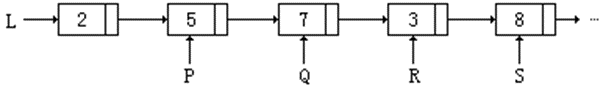

**（1）**

```c
Q=P->next;
```


**（2）**

```c
L=P->next;
```

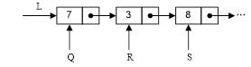

**（3）**

```c
R->data=P->data;
```


**（4）**

```c
R->data=P->next->data;
```

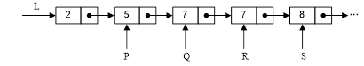

**（5）**

```c
P->next->next->next->data=P->data;
```


**（6）**

```c
T=P;
while(T!=NULL)
{
  T->data=T->data*2;
  T=T->next;
}
```


**（7）**

```c
T=P;
while(T->next!=NULL)
{
  T->data=T->data*2;
  T=T->next;
}
```


> 注：虽然原图中最后有省略号，但是在做此题时应将S结点视为链表的最后一个结点。
> &emsp;&emsp;因为从出题人的角度出发，该题与2.4.6题要形成对照。

### 2.5 画出执行下列各行语句后各指针及链表的示意图。

```c
L = (LinkList) malloc (sizeof(LNode));
P = L;
for(i=1; i<=4; i++)
{
  P->next= (LinkList) malloc (sizeof(LNode));
  P = P->next;
  P->data = i*2-1;
}
P->next = NULL;
for(i=4; i>=1; i--)
  Ins_LinkList(L, i+1, i*2);
for(i=1; i<=3; i++)
  Del_LinkList(L, i);
```

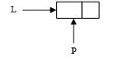
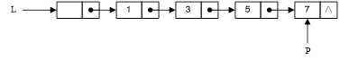
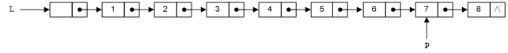
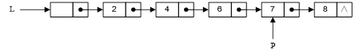

### 2.6 已知L是无表头结点的单链表，且P结点既不是首元结点，也不是尾元结点，试从下列提供的答案中选择合适的语句序列。
>a.在P结点后插入S结点的语句序列是 <u>（4）（1）</u>。</br>
>b.在P结点前插入S结点的语句序列是 <u>（7）（11）（8）（4）（1）</u>。</br>
>c.在表首插入S结点的语句序列是 <u>（5）（12）</u>。</br>
>d.在表尾插入S结点的语句序列是 <u>（9）（1）（6）</u>。</br>
>
>（1）P->next=S;</br>
>（2）P->next=P->next->next;</br>
>（3）P->next=S->next;</br>
>（4）S->next=P->next;</br>
>（5）S->next=L;</br>
>（6）S->next=NULL;</br>
>（7）Q=P;</br>
>（8）while(P->next!=Q)</br>
>&nbsp;&nbsp;&nbsp;&nbsp;&nbsp;&nbsp;&nbsp;&nbsp;&nbsp;&nbsp;P=P->next;</br>
>（9）while(P->next!=NULL)</br>
>&nbsp;&nbsp;&nbsp;&nbsp;&nbsp;&nbsp;&nbsp;&nbsp;&nbsp;&nbsp;P=P->next;</br>
>（10）P=Q;</br>
>（11）P=L;</br>
>（12）L=S;</br>
>（13）L=P;</br>

### 2.7 已知L是带表头结点的非空单链表，且P结点既不是首元结点，也不是尾元结点，试从下列提供的答案中选择合适的语句序列。

>a.删除P结点的直接后继结点的语句序列是 <u>（11）（3）（14）</u>。</br>
>b.删除P结点的直接前驱结点的语句序列是 <u>（10）（12）（8）（11）（3）（14）</u>。</br>
>c.删除P结点的语句序列是 <u>（10）（12）（7）（3）（14）</u>。</br>
>d.删除首元结点的语句序列是 <u>（12）（11）（3）（14）</u>。</br>
>e.删除尾元结点的语句序列是 <u>（9）（11）（3）（14）</u>。</br>
>
>（1）P=P->next;</br>
>（2）P->next=P;</br>
>（3）P->next=P->next->next;</br>
>（4）P=P->next->next;</br>
>（5）while(P!=NULL)</br>
>&nbsp;&nbsp;&nbsp;&nbsp;&nbsp;&nbsp;&nbsp;&nbsp;&nbsp;&nbsp;P=P->next;</br>
>（6）while(Q->next!=NULL)</br>
>&nbsp;&nbsp;&nbsp;&nbsp;&nbsp;&nbsp;&nbsp;&nbsp;{</br>
>&nbsp;&nbsp;&nbsp;&nbsp;&nbsp;&nbsp;&nbsp;&nbsp;&nbsp;&nbsp;P=Q;</br>
>&nbsp;&nbsp;&nbsp;&nbsp;&nbsp;&nbsp;&nbsp;&nbsp;&nbsp;&nbsp;Q=Q->next;</br>
>&nbsp;&nbsp;&nbsp;&nbsp;&nbsp;&nbsp;&nbsp;&nbsp;}</br>
>（7）while(P->next!=Q)</br>
>&nbsp;&nbsp;&nbsp;&nbsp;&nbsp;&nbsp;&nbsp;&nbsp;&nbsp;&nbsp;P=P->next;</br>
>（8）while(P->next->next!=Q)</br>
>&nbsp;&nbsp;&nbsp;&nbsp;&nbsp;&nbsp;&nbsp;&nbsp;&nbsp;&nbsp;P=P->next;</br>
>（9）while(P->next->next!=NULL)</br>
>&nbsp;&nbsp;&nbsp;&nbsp;&nbsp;&nbsp;&nbsp;&nbsp;&nbsp;&nbsp;P=P->next;</br>
>（10）Q=P;</br>
>（11）Q=P->next;</br>
>（12）P=L;</br>
>（13）L=L->next;</br>
>（14）free(Q);</br>

### 2.8 已知P结点是某双向链表的中间结点，试从下列提供的答案中选择合适的语句序列。

>a.在P结点后插入S结点的语句序列是 <u>（7）（12）（3）（6）</u>。</br>
>b.在P结点前插入S结点的语句序列是 <u>（8）（4）（5）（13）</u>。</br>
>c.删除P结点的直接后继结点的语句序列是 <u>（15）（1）（11）（18）</u>。</br>
>d.删除P结点的直接前驱结点的语句序列是 <u>（16）（2）（10）（18）</u>。</br>
>e.删除P结点的语句序列是 <u>（14）（9）（17）</u>。</br>
> 
>（1）P->next=P->next->next;</br>
>（2）P->priou=P->priou->priou;</br>
>（3）P->next=S;</br>
>（4）P->priou=S;</br>
>（5）S->next=P;</br>
>（6）S->priou=P;</br>
>（7）S->next=P->next;</br>
>（8）S->priou=P-priou;</br>
>（9）P->priou->next=P->next;</br>
>（10）P->priou->next=P;</br>
>（11）P->next->priou=P;</br>
>（12）P->next->priou=S;</br>
>（13）P->priou->next=S;</br>
>（14）P->next->priou=P->priou;</br>
>（15）Q=P->next;</br>
>（16）Q=P->priou;</br>
>（17）free(P);</br>
>（18）free(Q);</br>

### 2.9 简述下列算法的功能。

**（1）**

```c
Status A(LinkedList L)	 //L是无表头结点的单链表
{
  if(L&&L->next)
  {
    Q=L;
    L=L->next;
    P=L;
    while(P->next)
      P=P->next;
    P->next=Q;
    Q->next=NULL;
  }
  return OK;
}//A
```

> （1）如果L的长度不小于2，则将首元结点删去并插入表尾。

**（2）**

```c
void BB(LNode *s, LNode *q)
{
  p=s;
  while(p->next!=q)
    p=p->next;
  p->next=s;
}//BB
void AA(LNode *pa, LNode *pb)
{//pa和pb分别指向单循环链表中的两个结点
  BB(pa, pb);
  BB(pb, pa);
}//AA
```

> （2）将单循环链表拆成两个单循环链表。

## 二、算法设计题

##### 本章算法题目涉及的顺序表和线性链表的类型定义如下：

```c
#define LIST_INIT_SIZE 100
#define LISTINCREMENT 10
typedef struct
{
  ElemType *elem; //存储空间基址
  int  length;    //当前长度
  int  listsize;  //当前分配的存储容量
}SqList;  //顺序表类型

// 注：此文档中，ElemType被定义为int类型。

typedef struct LNode
{
  ElemType	data;
  Struct	Lnode	*next;
}LNode, *LinkList;  //线性链表类型
```

### 2.10 指出以下算法的错误和低效（即费时）之处，并将它改写为一个既正确又高效的算法。

```c
Status	DeleteK(SqList &a, int i, int k)
{ //本过程从顺序存储结构的线性表a中删除第i个元素起的k个元素
  if(i<1 || k<0 || i+k>a.length)
    return INFEASIBLE; //参数不合法
  else
    for(count=1; count<k; count++)
    { //删除一个元素
      for(j=a.length; j>=i+1; j--)
        a.elem[j-1] = a.elem[j];
      a.length--;
    }
  return OK;
} //DeleteK
```

>错误有两处：
> 
>（1）参数不合法的判别条件不完整。合法的入口参数条件为：（删除时包括第i个元素）</br>
>&nbsp;&nbsp;&nbsp;&nbsp;&nbsp;&nbsp;&nbsp;&nbsp;&nbsp;&nbsp;&nbsp;&nbsp;&nbsp;&nbsp;&nbsp;&nbsp;&nbsp;&nbsp;&nbsp;&nbsp;(0<i≤a.length)&&	(0≤k≤a.length-i+1)</br>
>（2）第二个for语句中，元素前移的次序错误。</br>
> 
>低效之处是每次删除一个元素的策略。
> 
>修改如下：
>
>[Question-2.10-main.c](▼习题测试文档-02/Question-2.10-main.c)

### 2.11 设顺序表va中的数据元素递增有序。试写一算法，将x插入到顺序表的适当位置上，以保持该表的有序性。

>[Question-2.11-main.c](▼习题测试文档-02/Question-2.11-main.c)

### 2.12 设A=(a1,...,an)和B=(b1,...,bn)均为顺序表，A'和B'分别为A和B中除去最大共同前缀后的子表（例如，A=(x,y,y,z,x,z)，B=(x,y,y,z,y,x,x,z)，则两者中最大的共同前缀为(x,y,y,z)，在两表中除去最大共同前缀后的子表分别为A'=(x,z)和B'=(y,x,x,z)）。若A'=B'=空表，则A=B；若A'=空表，而B'≠空表，或者两者均不为空表，且A'的首元小于B'的首元，则A<B；否则A>B。试写一个比较A，B大小的算法（请注意：在算法中，不要破坏原表A和B，并且，也不一定先求得A'和B'才进行比较）。

>[Question-2.12-main.c](▼习题测试文档-02/Question-2.12-main.c)

### 2.13 试写一算法在带头结点的单链表结构上实现线性表操作LOCATE(L,X)。

>[Question-2.13-main.c](▼习题测试文档-02/Question-2.13-main.c)

### 2.14 试写一算法在带头结点的单链表结构上实现线性表操作LENGTH(L)。

>[Question-2.14-main.c](▼习题测试文档-02/Question-2.14-main.c)

### 2.15 已知指针ha和hb分别指向两个单链表的头结点，并且已知两个链表的长度分别为m和n。试写一算法将这两个链表连接在一起（即令其中一个表的首元结点连在另一个表的最后一个结点之后），假设指针hc指向连接后的链表的头结点，并要求算法以尽可能短的时间完成连接运算。请分析你的算法和时间复杂度。

>[Question-2.15-main.c](▼习题测试文档-02/Question-2.15-main.c)

### 2.16 已知指针la和lb分别指向两个无头结点单链表中的首元结点。下列算法是从表la中删除自第i个元素起共len个元素后，将它们插入到表lb中的第j个元素之前。试问此算法是否正确？如有错，则请改正之。

```c
Status DeleteAndInsertSub (LinkedList la, LinkedList lb, int i, int j, int len)
{
  if(i<0 || j<0 || len<0)
    return INFEASIBLE;
  p=la;	k=1;
  while(k<i)
  {
    p=p->next;
    k++;
  }
  q=p;
  while(k<=len)
  {
    q=q->next;
    k++;
  }
  s=lb;
  k=1;
  while(k<j)
  {
    s=s->next;
    k++;
  }
  s->next=p;
  q->next=s->next;
  return OK;
} //DeleteAndInsertSub
```

### 2.17 试写一算法，在无头结点的动态单链表上实现线性表操作INSERT(L, i, b)，并和在带头结点的动态单链表上实现相同操作的算法进行比较。

### 2.18 同2.17题要求。试写一算法，实现线性表操作DELETE(L, i)。

>[Question-2.16~2.18-main.c](▼习题测试文档-02/Question-2.16~2.18-main.c)

### 2.19 已知线性表中的元素以值递增有序排列，并以单链表作存储结构。试写一高效的算法，删除表中所有值大于mink且小于maxk的元素（若表中存在这样的元素），同时释放被删结点空间，并分析你的算法的时间复杂度（注意：mink和maxk是给定的两个参变量，它们的值可以和表中的元素相同，也可以不同）。

> 时间复杂度分析：最坏的情况是全部扫描完也没找到适合的元素，故时间复杂度与链表长度有关，为O(Length(L))。

### 2.20 同2.19题条件（递增有序排列），试写一高效的算法，删除表中所有值相同的多余元素（使得操作后的线性表中所有元素的值均不相同），同时释放被删结点空间，并分析你的算法的时间复杂度。

>[Question-2.19~2.20-main.c](▼习题测试文档-02/Question-2.19~2.20-main.c)

### 2.21 试写一算法，实现顺序表的就地逆置，即利用原表的存储空间将线性表(a1, a2, ..., an)逆置为(an, an-1, ..., a1)。

>[Question-2.21-main.c](▼习题测试文档-02/Question-2.21-main.c)

### 2.22 试写一算法，对单链表实现就地逆置。

>[Question-2.22-main.c](▼习题测试文档-02/Question-2.22-main.c)

### 2.23 设线性表A=(a1, a2, ..., am)，B=(b1, b2, ..., bn)，试写一个按下列规则合并A，B为线性表C的算法，即使得
###### &nbsp;&nbsp;&nbsp;&nbsp;&nbsp;&nbsp;&nbsp;&nbsp;&nbsp;&nbsp;&nbsp;C=(a1, b1, ..., am, bm, bm+1, ..., bn)		当m<=n时；
###### 或者&nbsp;&nbsp;&nbsp;&nbsp;&nbsp;C=(a1, b1, ..., an, bn, an+1, ..., am)		当m>n时。
### 线性表A，B和C均以单链表作存储结构，且C表利用A表和B表中的结点空间构成。注意：单链表的长度值m和n均未显式存储。

>[Question-2.23-main.c](▼习题测试文档-02/Question-2.23-main.c)

> 关键词：单链表

### 2.24 假设有两个按元素值递增有序排列的线性表A和B，均以单链表作存储结构，请编写算法将A表和B表归并成一个按元素值递减有序（即非递增有序，允许表中含有值相同的元素）排列的线性表C，并要求利用原表（即A表和B表）的结点空间构造C表。

>[Question-2.24-main.c](▼习题测试文档-02/Question-2.24-main.c)

> 关键词：递增单链表

### 2.25 假设以两个元素依值递增有序排列的线性表A和B分别表示两个集合（即同一表中的元素值各不相同），现要求另辟空间构成一个线性表C，其元素为A和B中元素的交集，且表C中的元素也依值递增有序排列。试对顺序表编写求C的算法。

>[Question-2.25-main.c](▼习题测试文档-02/Question-2.25-main.c)

> 关键词：递增无重复顺序表

### 2.26 要求同2.25题。试对单链表编写求C的算法。

>[Question-2.26-main.c](▼习题测试文档-02/Question-2.26-main.c)

> 关键词：递增无重复单链表

### 2.27 对2.25题的条件作以下修改，对顺序表重新编写求得表C的算法。
###### （1）假设在同一表（A或B）中可能存在值相同的元素，但要求新生成的表C中的元素值各不相同；
###### （2）利用A表空间存放表C。

>[Question-2.27-main.c](▼习题测试文档-02/Question-2.27-main.c)

> 关键词：递增有重复顺序表

### 2.28 对2.25题的条件作以下两点修改，对单链表重新编写求得表C的算法。
###### （1）假设在同一表（A或B）中可能存在值相同的元素，但要求新生成的表C中的元素值各不相同。
###### （2）利用原表（A表或B表）中的结点构造表C，并释放A表中的无用结点空间。

>[Question-2.28-main.c](▼习题测试文档-02/Question-2.28-main.c)

> 关键词：递增有重复单链表，释放无效结点

### 2.29 已知A，B和C为三个递增有序的线性表，现要求对A表作如下操作：删去那些既在B表中出现，又在C表中出现的元素。试对顺序表编写实现上述操作的算法，并分析你的算法的时间复杂度（注意：同一表中各元素值可能相同）。

>[Question-2.29-main.c](▼习题测试文档-02/Question-2.29-main.c)

### 2.30 要求同2.29题。试对单链表编写算法，请释放A表中的无用结点空间。

>[Question-2.30-main.c](▼习题测试文档-02/Question-2.30-main.c)

### 2.31 假设某个单向循环链表的长度大于1，且表中既无头结点也无头指针。已知s为指向链表中某个结点的指针，试编写算法在链表中删除指针s所指结点的前驱结点。

>[Question-2.31-main.c](▼习题测试文档-02/Question-2.31-main.c)

### 2.32 已知有一个单向循环链表，其每个结点中含三个域：pre，data和next，其中data为数据域，next为指向后继结点的指针域，pre也为指针域，但它的值为空(NULL)，试编写算法将此单向循环链表改为双向循环链表，即使pre称为指向前驱结点的指针域。

>[Question-2.32-main.c](▼习题测试文档-02/Question-2.32-main.c)

### 2.33 已知由一个线性链表表示的线性表中含有三类字符的数据元素（如：字母字符、数字字符和其他字符），试编写算法将该线性链表分割为三个循环链表，其中每个循环链表表示的线性表中均只含一类字符。

>[Question-2.33-main.c](▼习题测试文档-02/Question-2.33-main.c)

##### 在2.34至2.36题中，“异或指针双向链表”类型`XorLinkedList`和指针异或函数`XorP`定义为：

```c
typedef struct XorNode
{
    char data;
    struct XorNode LRPtr;
} XorNode, *XorPointer;

//无头结点的异或指针双向链表
typedef struct
{ 
    XorPointer Left, Right; //分别指向链表的左端和右端
} XorLinkedList;

XorPointer XorP(XorPointer p, XorPointer q);  //指针异或函数XorP返回指针p和q的异或(XOR)值
```

##### 异或表

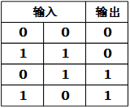

##### 异或指针链表的动态创建过程

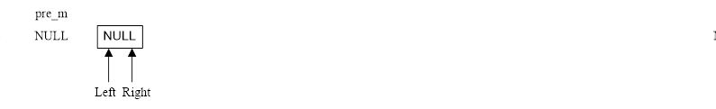
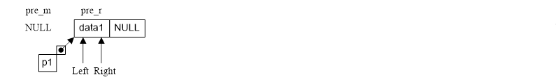
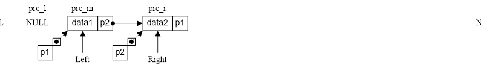
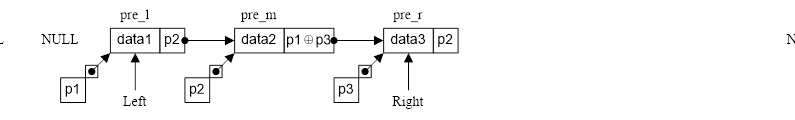
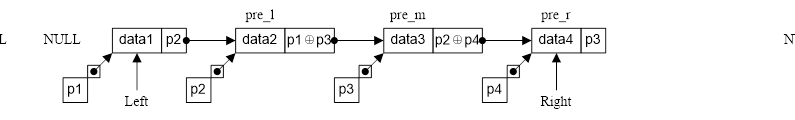
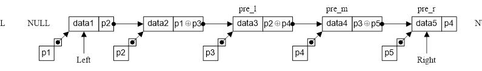

### 2.34 假设在算法描述语言中引入指针的二元运算“异或”（用“⊕”表示），若a和b为指针，则a⊕b的运算结果仍为原指针类型，且：
##### a⊕(a⊕b)=(a⊕a)⊕b=b
##### (a⊕b)⊕b=a⊕(b⊕b)=a
### 则可利用一个指针域来实现双向链表L。链表L中的每个结点只含两个域：data域和LRPtr域，其中LRPtr域存放该结点的左邻与右邻结点指针（不存在时为NULL）的异或。若设指针L.Left指向链表中的最左结点，L.Right指向链表中的最右结点，则可实现从左向右或从右向左遍历此双向链表的操作。试写一算法按任一方向依次输出链表中各元素的值。

### 2.35 采用2.34题所述的存储结构，写出在第i个结点之前插入一个结点的算法。

### 2.36 采用2.34题所述的存储结构，写出删除第i个结点的算法。

>[Question-2.34~2.36-main.c](▼习题测试文档-02/Question-2.34~2.36-main.c)

### 2.37 设以带头结点的双向循环链表表示的线性表L=(a1, a2, ..., an)，试写一时间复杂度为O(n)的算法，将L改造为L=(a1, a3, ..., an, ..., a4, a2)。

>[Question-2.37-main.c](▼习题测试文档-02/Question-2.37-main.c)

### 2.38 设有一个双向循环链表，每个结点中除有pre，data和next三个域外，还增设了一个访问频度域freq。在链表被起用之前，频度域freq的值均初始化为零，而每当对链表进行一次LOCATE(L, x)的操作后，被访问的结点（即元素值等于x的结点）中的频度域freq的值便增1，同时调整链表中结点之间的次序，使其按访问频度非递增的次序顺序排列，以便始终保持被频繁访问的结点总是靠近表头结点，试编写符合上述要求的LOCATE操作的算法。

>[Question-2.38-main.c](▼习题测试文档-02/Question-2.38-main.c)

##### 在2.39至2.40题中，稀疏多项式采用的顺序存储结构SqPoly定义为

```c
typedef struct
{
    int coef;
    int exp;
} PolyTerm;
typedef struct
{ //多项式的顺序存储结构
    PolyTerm *data;
    int last;
} SqPoly;
```

### 2.39 已知稀疏多项式：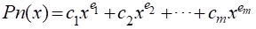，其中n=em>em-1>…>e1≥0，ci≠0(i=1,2,...,m),m≥1。试采用存储量同多项式项数m成正比的顺序存储结构，编写求Pn(x0)的算法(x0为给定值)，并分析你的算法的时间复杂度。

> 时间复杂度为O(n)，只与顺序表长度有关。
	
### 2.40 采用2.39题给定的条件和存储结构，编写求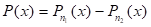的算法，将结果多项式存放在新辟的空间中，并分析你的算法的时间复杂度。

>[Question-2.39~2.40-main.c](▼习题测试文档-02/Question-2.39~2.40-main.c)

##### 在2.41至2.42题中，稀疏多项式采用的循环链表存储结构LinkedPoly定义为

```c
typedef struct PolyNode
{
    PolyTerm data;
    struct PolyNode *next;
} PolyNode, *PolyLink;
typedef PolyLink LinkedPoly;
```

### 2.41 试以循环链表作稀疏多项式的存储结构，编写求其导函数的算法，要求利用原多项式中的结点空间存放其导函数（多项式），同时释放所有无用（被删）结点。

### 2.42 试编写算法，将一个用循环链表表示的稀疏多项式分解成两个多项式，使这两个多项式中各自仅含奇次项或偶次项，并要求利用原链表中的结点空间构成这两个链表。

>[Question-2.41~2.42-main.c](▼习题测试文档-02/Question-2.41~2.42-main.c)
