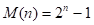

# 第3章 栈和队列

## 一、基础知识题

### 3.1 若按教科书3.1.1节中图3.1(b)所示铁道进行车厢调度（注意：两侧铁道均为单向行驶道），则请回答：


##### (1) 如果进站的车厢序列为123，则可能得到的出站车厢序列是什么？

> （1）123 231 321 213 132


##### (2) 如果进站的车厢序列为123456，则能否得到435612和135426的出站序列，并请说明为什么不能得到或者如何得到（即写出以‘S’表示进栈和以‘X’表示出栈的栈操作序列）。

> （2）可以得到135426的出站序列，其相应操作为：SXSSXSSXXXSX。不能得到435612的出站序列。因为4356出站说明12已经在栈中，1不可能先于2出栈。

### 3.2 简述栈和线性表的差别。

> 线性表是具有相同特性的数据元素的一个有限序列。栈是限定仅在表尾进行插入或删除操作的线性表。

### 3.3 写出下列程序段的输出结果（栈的元素类型SElemType为char）。

```c
void main()
{
    Stack S;
    char x, y;
    InitStack(S);
    x = ’c’;
    y = ’k’;
    Push(S, x);	
    Push(S, ‘a’);
    Push(S, y);	
    Pop(S, x);
    Push(S,‘t’);
    Push(S, x);
    Pop(S, x);
    Push(S,‘s’);
    while(!StackEmpty(S))
    { 
        Pop(S,y);
        printf(y);
    }
    printf(x);
}
```

> 输出结果：stack

### 3.4 	简述以下算法的功能（栈的元素类型SElemType为int）。

**(1)**

```c
status algo1(Stack S)
{
    int i, n, A[255];
    n=0;
    while(!StackEmpty(S))
    {
        n++;
        Pop(S, A[n]);
    }
    for(i=1; i<=n; i++)
        Push(S, A[i]);
}
```

> 栈中的数据元素逆置。

**(2)**

```c
status algo2(Stack S,int e)
{
    Stack T;
    int d;
    InitStack(T);
    while(!StackEmpty(S))
    {
        Pop(S, d);
        if(d!=e)
            Push(T, d);
    }
    while(!StackEmpty(T))
    {
        Pop(T, d);
        Push(S, d);
    }
}
```

> 如果栈中存在元素e，将其从栈中删除。

### 3.5 假设以S和X分别表示入栈和出栈的操作，则初态和终态均为空栈的入栈和出栈的操作序列可以表示为仅由S和X组成的序列。称可以操作的序列为合法序列（例如，SXSX为合法序列，SXXS为非法序列）。试给出区分给定序列为合法序列或非法序列的一般准则，并证明：两个不同的合法（栈操作）序列（对同一输入序列）不可能得到相同的输出元素（注意：在此指的是元素实体，而不是值）序列。

> 区分准则：  
> 任何前n个序列中S的个数一定不小于X的个数。  
>  
> 证明：  
>  
> 设两个合法序列为：  
> T1 = S……X……S……  
> T2 = S……X……X……  
>  
> 假定前n个操作都相同，从第n+1个操作开始，为序列不同的起始操作点。由于前n个操作相同，故此时两个栈（不妨为栈A、B）的存储情况完全相同，假设此时栈顶元素均为a。  
>  
> 第n+1个操作不同，不妨T1的第n+1个操作为S，T2的第n+1个操作为X。T1为入栈操作，假设将b压栈，则T1的输出顺序一定是先b后a；而T2将a退栈，则其输出顺序一定是先a后b。由于T1的输出为……ba……，而T2的输出顺序为……ab……，说明两个不同的合法栈操作序列的输出元素的序列一定不同。  

### 3.6 试证明：若借助栈由输入序列12…n得到的输出序列为p1p2…pn(它是输入序列的一个排列)，则在输出序列中不可能出现这样的情形：存在着i<j<k使pj<pk<pi。

> 这个问题和3.1题比较相似。因为输入序列是从小到大排列的，所以若pj<pk<pi，则可以理解为通过输入序列pj，pk，pi可以得到输出序列pi，pj，pk，显然通过序列123是无法得到312的，参见3.1题。所以不可能存在着i<j<k使pj<pk<pi。

### 3.7 按照四则运算加、减、乘、除和幂运算(↑)优先关系的惯例，并仿照教科书3.2节例3-2的格式，画出对算术表达式 A-B×C/D+E↑F 求值时操作数栈和运算符栈的变化过程：

> 设：BC=G  G/D=H  A-H=I  E^F=J  I+J=K  

|步骤|OPTR栈|OPND栈|输入字符|主要操作|
|-----|:--------|:---------|---------:|---------|
|1| `#`|      |`A-B*C/D+E^F#`|`PUSH(OPND,A)`|
|2| `#`| `A`|`-B*C/D+E^F#`|`PUSH(OPTR,-)`|
|3| `#-`|`A`|`B*C/D+E^F#`|`PUSH(OPND,B)`|
|4| `#-`|`A B`| `*C/D+E^F#` |`PUSH(OPTR,*)`|
|5| `#-*`|`A B`| `C/D+E^F#`|`PUSH(OPND,C)`|
|6|`#-*`|`A B C`|`/D+E^F#`|`Operate(B,*,C)`|
|7|`#-`|`A G`|`/D+E^F#`|`PUSH(OPTR,/)`|
|8|`#-/`|`A G`| `D+E^F#`|`PUSH(OPND,D)`|
|9|`#-/`|`A G D`|`+E^F#`|`Operate(G,/,D)`|
|10|`#-`|`A H`|`+E^F#`|`Operate(A,-,H)`|
|11|`#`|`I`|`+E^F#`|`PUSH(OPTR,+)`|
|12|`#+`|`I`| `E^F#`|`PUSH(OPND,E)`|
|13|`#+`|`I E`| `^F#` |`PUSH(OPTR,^)`|
|14|`#+^`|`I E`|`F#`|`PUSH(OPND,F)`|
|15|`#+^`|`I E F`| `#` |`Operate(E,^,F)`|
|16|`#+`|`I J`| `#` |`Operate(I,+,J)`|
|17|`#`|`K`| `#` |`RETURN`|

### 3.8 试推导求解n阶梵塔问题至少要执行的move操作的次数。

> 设至少要执行M(n)次move操作，则  
>   
> 解此方程可得 。  

### 3.9 试将下列递推过程改写为递归过程。

```c
void ditui(int n)
{
    int i;
    i = n;
    while(i>1)
        cout<<i--;
}
```

> 递归过程如下：  
>  
> void digui(int j)  
> {  
> &nbsp;&nbsp;&nbsp;&nbsp;if(j>1)  
> &nbsp;&nbsp;&nbsp;&nbsp;{  
> &nbsp;&nbsp;&nbsp;&nbsp;&nbsp;&nbsp;&nbsp;&nbsp;cout<<j;  
> &nbsp;&nbsp;&nbsp;&nbsp;&nbsp;&nbsp;&nbsp;&nbsp;digui(j-1);  
> &nbsp;&nbsp;&nbsp;&nbsp;}  
> &nbsp;&nbsp;&nbsp;&nbsp;return;  
> }  
  
### 3.10 试将下列递归过程改写为非递归过程。

```c
void test(int &sum)
{
  int x;
  cin>>x;
  if(x==0) 
    sum=0;
  else
  {
    test(sum);
    sum+=x;
  }
  cout<<sum;
}
```

> 非递归过程如下：  
>  
> void test(int &sum)  
> {  
> &nbsp;&nbsp;&nbsp;&nbsp;Stack s;  
> &nbsp;&nbsp;&nbsp;&nbsp;int x;  
> &nbsp;&nbsp;&nbsp;&nbsp;scanf(x);  
> &nbsp;&nbsp;&nbsp;&nbsp;InitStack(s);  
> &nbsp;&nbsp;&nbsp;&nbsp;while(x)  
> &nbsp;&nbsp;&nbsp;&nbsp;{  
> &nbsp;&nbsp;&nbsp;&nbsp;&nbsp;&nbsp;&nbsp;&nbsp;Push(S,x);  
> &nbsp;&nbsp;&nbsp;&nbsp;&nbsp;&nbsp;&nbsp;&nbsp;scanf(x);  
> &nbsp;&nbsp;&nbsp;&nbsp;}  
> &nbsp;&nbsp;&nbsp;&nbsp;sum=0;  
> &nbsp;&nbsp;&nbsp;&nbsp;printf(sum);  
> &nbsp;&nbsp;&nbsp;&nbsp;while(Pop(S,x))  
> &nbsp;&nbsp;&nbsp;&nbsp;{  
> &nbsp;&nbsp;&nbsp;&nbsp;&nbsp;&nbsp;&nbsp;&nbsp;sum +=x;  
> &nbsp;&nbsp;&nbsp;&nbsp;&nbsp;&nbsp;&nbsp;&nbsp;printf(sum);  
> &nbsp;&nbsp;&nbsp;&nbsp;}  
> }  
>  

### 3.11 简述队列和堆栈这两种数据类型的相同点和差异处。

> 栈是一种运算受限的线性表，其限制是仅允许在表的一端进行插入和删除运算。  
> 队列也是一种运算受限的线性表，其限制是仅允许在表的一端进行插入，而在表的另一端进行删除。  

### 3.12 写出以下程序段的输出结果（队列中的元素类型QElemType为char）。

```c
void main()
{
  Queue Q;
  InitQueue(Q);
  char x= ‘e’, y= ‘c’;
  EnQueue(Q, ‘h’);
  EnQueue(Q, ‘r’);
  EnQueue(Q, y);
  DeQueue(Q, x);
  EnQueue(Q, x);
  DeQueue(Q, x);
  EnQueue(Q, ‘a’);
  While(!QueueEmpty(Q))
  {
    DeQueue(Q,y);
    cout<<y;
  }
  cout<<x;
}
```

> 输出结果：char  

### 3.13 简述以下算法的功能（栈和队列的元素类型均为int）。

```c
void algo3(Queue &Q)
{
  Stack S;
  int d;
  InitStack(S);
  while(!QueueEmpty(Q))
  {
    DeQueue(Q, d);
    Push(S, d);
  }
  while(!StackEmpty(S))
  {
    Pop(S, d);
    EnQueue(Q, d);
  }
}
```

> 功能：利用栈的特长进行队列逆置。  

### 3.14 若以1234作为双端队列的输入序列，试分别求出满足以下条件的输出序列：
##### (1) 能由输入受限的双端队列得到，但不能由输出受限的双端队列得到的输出序列。
##### (2) 能由输出受限的双端队列得到，但不能由输入受限的双端队列得到的输出序列。
##### (3) 既不能由输入受限的双端队列得到，也不能由输出受限的双端队列得到的输出序列。

> 注：输入顺序确定，但是输入输出的方式不定，可以边输入边输出。  
>   
>（1）4 1 3 2  
>（2）4 2 1 3  
>（3）4 2 3 1  
>   
> 提示：不要穷举所有输入输出，而是穷举1234可能组成的24种排列方式，然后对每一种排列方式校验看是否满足题意。  

## 二、算法设计题

### 3.15 假设以顺序存储结构实现一个双向栈，即在一维数组的存储空间中存在着两个栈，它们的栈底分别设在数组的两个端点。试编写实现这个双向栈tws的三个操作：初始化inistack(tws)、入栈push(tws,i,x)和出栈pop(tws,i)的算法，其中i为0或1，用以分别指示设在数组两端的两个栈，并讨论按过程(正/误状态变量可设为变参)或函数设计这些操作算法各有什么有缺点。

> [Question-3.15-main.c](▼习题测试文档-03/Question-3.15-main.c)

### 3.16 假设如题3.1所属火车调度站的入口处有n节硬席或软席车厢（分别以H和S表示）等待调度，试编写算法，输出对这n节车厢进行调度的操作（即入栈或出栈操作）序列，以使所有的软席车厢都被调整到硬席车厢之前。


> [Question-3.16-main.c](▼习题测试文档-03/Question-3.16-main.c)

### 3.17 试写一个算法，识别一次读入的一个以@为结束符的字符序列是否为形如‘序列1&序列2’模式的字符序列。其中序列1和序列2中都不含字符‘&’，且序列2是序列1的逆序列。例如，‘a+b&b+a’是属该模式的字符序列，而‘1+3&3-1’则不是。

> [Question-3.17-main.c](▼习题测试文档-03/Question-3.17-main.c)

### 3.18 试写一个判别表达式中开、闭括号是否配对出现的算法。

> [Question-3.18-main.c](▼习题测试文档-03/Question-3.18-main.c)

### 3.19 假设一个算数表达式中可以包含三种符号：圆括号“(”和“)”、方括号“[”和“]”和花括号“{”和“}”，且这三种括号可按任意的次序嵌套使用（如：…[…{…}…[…]…]…[…]…(…)…）。编写判别给定表达式中所含括号是否正确配对出现的算法（已知表达式已存入数据元素为字符的顺序表中）。

> [Question-3.19-main.c](▼习题测试文档-03/Question-3.19-main.c)

### 3.20 假设以二维数组g(1…m, 1…n)表示一个图像区域，g[i,j]表示该区域中点(i,j)所具颜色，其值为从0到k的整数。编写算法置换点(i0,j0)所在区域的颜色。约定和(i0,j0)同色的上、下、左、右的邻接点为同色区域的点。

> [Question-3.20-main.c](▼习题测试文档-03/Question-3.20-main.c)

### 3.21 假设表达式有单字母变量（下面算法中将改为只有一位的数字）和双目四则运算符构成。试写一个算法，将一个通常书写形式且书写正确的表达式转换为逆波兰表达式。

> [Question-3.21-main.c](▼习题测试文档-03/Question-3.21-main.c)

### 3.22 如题3.21的假设条件，试写一个算法，对以逆波兰式表示的表达式求值。

> [Question-3.22-main.c](▼习题测试文档-03/Question-3.22-main.c)

### 3.23 如题3.21的假设条件，试写一个算法，判断给定的非空后缀表达式是否为正确的逆波兰表达式，如果是，则将它转化为波兰式。

> [Question-3.23-main.c](▼习题测试文档-03/Question-3.23-main.c)

### 3.24 试编写如下定义的递归函数的递归算法，并根据算法画出求g(5,2)时栈的变化过程。


> [Question-3.24-main.c](▼习题测试文档-03/Question-3.24-main.c)

### 3.25 试写出求递归函数F(n)的递归算法，并消除递归：


> [Question-3.25-main.c](▼习题测试文档-03/Question-3.25-main.c)

### 3.26 求解平方根的迭代函数定义如下：


### 其中，p是A的近似平方根，e是结果允许误差。试写出相应的递归算法，并消除递归。

> [Question-3.26-main.c](▼习题测试文档-03/Question-3.26-main.c)

### 3.27 已知Ackerman函数的定义如下：


##### (1) 写出递归算法；
##### (2) 写出非递归算法；
##### (3) 根据非递归算法，画出求akm(2,1)时栈的变化过程。

> [Question-3.27-main.c](▼习题测试文档-03/Question-3.27-main.c)

### 3.28 假设以带头结点的循环链表表示队列，并且只设一个指针指向队尾元素结点（注意不设头指针），试编写相应的队列初始化、入队列和出队列的算法。

> [Question-3.28-main.c](▼习题测试文档-03/Question-3.28-main.c)

### 3.29 如果希望循环队列中的元素都能得到利用，则需设置一个标志域tag，并以tag的值为0和1来区分，尾指针和头指针值相同时的队列状态是“空”还是“满”。试编写与此结构相应的入队列和出队列的算法，并从时间和空间角度讨论设标志和不设标志这两种方法的使用范围（如当循环队列容量较小而队列中每个元素占的空间较多时，哪一种方法较好）。

> [Question-3.29-main.c](▼习题测试文档-03/Question-3.29-main.c)

### 3.30 假设将循环队列定义为：以域变量rear和length分别指示循环队列中队尾元素的位置和内含元素的个数。试给出此循环队列的队满条件，并写出相应的入队列和出队列的算法（在出队列的算法中要返回队头元素）。

### 3.32 试利用循环队列编写求k阶菲波那契序列中前n+1项的算法，要求满足：而，其中max为某个约定的常数。（注意：本题所用循环队列的容量仅为k，则在算法执行结束时，留在循环队列中的元素应是所求k阶菲波那契序列中的最后k项）

> [Question-3.30 && 3.32-main.c](▼习题测试文档-03/Question-3.30%20&&%203.32-main.c)

### 3.31 假设称正读和反读都相同的字符序列为“回文”，例如，‘abba’和‘abcba’是回文，‘abcde’和‘ababab’则不是回文。试写一个算法判别读入的一个以‘@’为结束符的字符序列是否是“回文”。

> [Question-3.31-main.c](▼习题测试文档-03/Question-3.31-main.c)

### 3.33 在顺序存储结构上实现输出受限的双端循环队列的入列和出列（只允许队头出列）算法。设每个元素表示一个待处理的作业，元素值表示作业的预计时间。入队列采取简化的短作业优先原则，若一个新提交的作业的预计执行时间小于队头和队尾作业的平均时间，则插入在队头，否则插入在队尾。

> [Question-3.33-main.c](▼习题测试文档-03/Question-3.33-main.c)

### 3.34 假设在如教科书3.4.1节中图3.9所示的铁道转轨网的输入端有n节车厢：硬座、硬卧和软卧（分别以P，H和S表示）等待调度，要求这三种车厢在输出端铁道上的排列次序为：硬座（P）在前，软卧（S）在中，硬卧（H）在后。试利用输出受限（只允许队头出列）的双端队列对这n节车厢进行调度，编写算法输出调度的操作序列：分别以字符‘E’和‘D’表示对双端队列的头端进行入队列和出队列的操作；以字符A表示对双端队列的尾端进行入队列的操作。


> [Question-3.34-main.c](▼习题测试文档-03/Question-3.34-main.c)


