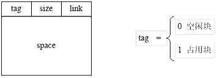
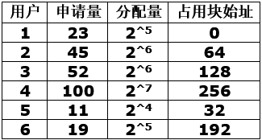
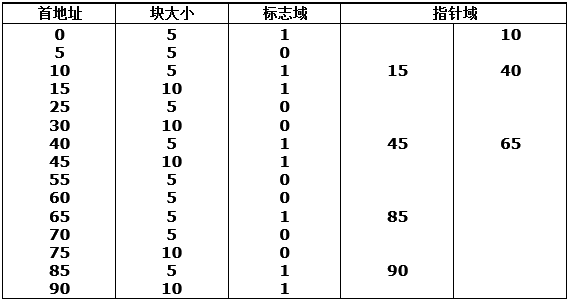

# 第8章 动态存储管理

## 一、基础知识题

### 8.1 假设利用边界标识法首次适配策略分配，已知在某个时刻的可利用空间表的状态如下图所示：

##### (1) 画出当系统回收一个起始地址为559、大小为45的空闲块之后的链表状态；
##### (2) 画出系统继而在接受存储块大小为100的请求之后，又回收一块起始地址为515、大小为44的空闲块之后的链表状态。
##### 注意：存储块头部中大小域的值和申请分配的存储量均包括头和尾的存储空间。

> (1) 回收后恰好与最后一个空闲块合并。    
> 

> (2) 接受100个内存块的请求：    
> 
>    
> 回收515处大小为44的内存块    
> 

### 8.2 组织成循环链表的可利用空间表可附加什么条件时，首次适配策略就转变为最佳适配策略?

> 将空闲块大小由小到大排列，头指针固定指向最小的内存块。

### 8.3 设两个大小分别为100和200的空闲块依次顺序链接成可利用空间表。设分配一块时，该块的剩余部分在可利用空间表中保持原链接状态，试分别给出满足下列条件的申请序列:
##### (1)最佳适配策略能够满足全部申请而首次适配策略不能；
##### (2)首次适配策略能够满足全部申请而最佳适配策略不能。

> (1)110，80，100    
> (2)110，80，90，20    
> 注：答案均不唯一。    

### 8.4 在变长块的动态存储管理方法中，边界标志法的算法效率为什么比以下图所示的结点结构组织的可利用空间表的算法效率高?

> 在申请内存和释放内存时，上图所示的结构不利于链接成一个新的空闲空间。

### 8.5 考虑边界标志法的两种策略(最佳适配和首次适配)：
##### (1)数据结构的主要区别是什么?
##### (2)分配算法的主要区别是什么?
##### (3)回收算法的主要区别是什么?

> (1)最佳适配策略下空闲块要按从小到大的顺序链接，可以不作成循环表，空闲块表头指针固定指向最小空闲块。首次分配则力求各种大小的块在循环表中均匀分布，所以经常移动头指针。    
> 
> (2)无本质区别。    
> 
> (3)最佳适配策略下（合并后）插入链表时必须保持表的有序性。    

### 8.7 已知一个大小为512字的内存，假设先后有6个用户提出大小分别为23，45，52，100，11和19的分配请求，此后大小为45，52和11的占用块顺序被释放。假设以伙伴系统实现动态存储管理，
##### (1)画出可利用空间表的初始状态；
##### (2)画出6个用户进入之后的链表状态以及每个用户所得存储块的起始地址；
##### (3)画出在回收三个用户释放的存储块之后的链表状态。

> (1) 初始状态只有一个大小为29的空闲内存块。    
> (2) 6个用户进入后，链表共剩3个空闲内存块，其大小分别为：24、25、27。每个用户获得的存储块的起始地址分别为：
> 
> (3)在回收三个用户的存储后，链表中剩余5个内存块，大小为25和26的块各两块，27的块各1块。    

### 8.8 试求一个满足以下条件的空间申请序列a1，a2，…，an：从可用空间为25的伙伴管理系统的初始状态开始，a1，a2，…，an-1均能满足，而an不能满足，并使最小。

> 暂未理解题意。如有好的见解，欢迎提交Issues。

### 8.9 设有五个广义表：L=(L1, L3)，L1=(L2, L3, L4)，L2=(L3)，L3=( )，L4=(L2)。若利用访问计数器实现存储管理，则需对每个表或子表添加一个表头结点，并在其中设一计数域。
##### (1)试画出表L的带计数器的存储结构；
##### (2)从表L中删除子表L1时，链表中哪些结点可以释放？各子表的计数域怎样改变？
##### (3)若L2=(L3, L4)，将会出现什么现象？

> 暂未想到合适的解决方案。如有好的方案，欢迎提交Issues。

### 8.10 假设利用“堆”结构进行动态存储管理。执行存储紧缩过程之前，存储器的格局如下表所示。请用表格方式给出存储紧缩过程执行之后的存储器格局。

.

> 暂未理解题意。如有好的见解，欢迎提交Issues。

## 二、算法设计题

### 8.11 考虑空间释放遵从“最后分配者最先释放（栈）”规则的动态存储管理问题，并设每个空间申请中都指定所申请的空闲块大小。
##### (1)设计一个适当的数据结构实现动态存储管理;
###### (2)写一个为大小为n的空间申请分配存储块的算法。

> (1)内存信息存储在栈中，而内存空间用内存块的起始地址、终止地址，当前块的起始地址来描述。    
> (2)若申请的空间大于剩余内存块空间，则需先释放一部分空间。    

### 8.12 同8.11题条件，写一个回收释放块的算法。

> [Question-8.11~8.12-main.c](▼习题测试文档-08/Question-8.11~8.12-main.c)

### 8.13 试完成边界标志法和依首次适配策略进行分配相应的回收释放块的算法。

> [Question-8.13-main.c](▼习题测试文档-08/Question-8.13-main.c)

### 8.14 试完成伙伴管理系统的存储回收算法。

> [Question-8.14-main.c](▼习题测试文档-08/Question-8.14-main.c)

### 8.15 设被管理空间的上下界地址分别由变量highbound和lowbound给出，形成一个由同样大小的块组成的“堆”。试写一个算法，将所有tag域的值为0的块按始址递增顺序链接成一个可利用空间表（设块大小域为cellsize）。

> [Question-8.15-main.c](▼习题测试文档-08/Question-8.15-main.c)

### 8.16 试完成教科书中8.6节所述的存储紧缩算法。

> [Question-8.16-main.c](▼习题测试文档-08/Question-8.16-main.c)

