# 第9章 查找

## 一、基础知识题

### 9.1 若对大小均为n的有序的顺序表和无序的顺序表分别进行顺序查找，试在下列三种情况下分别讨论两者在等概率时的平均查找长度是否相同？
##### (1)查找不成功，即表中没有关键字等于给定值K的记录；
##### (2)查找成功，且表中只有一个关键字等于给定值K的记录；
##### (3)查找成功，且表中有若干个关键字等于给定值K的记录，一次查找要求找出所有记录。此时的平均查找长度应考虑找到所有记录时所用的比较次数。

> (1)相同    
> (2)不相同    
> (3)不相同    

### 9.2 试分别画出在线性表(a,b,c,d,e,f,g)中进行折半查找，以查关键字等于e，f和g的过程。

> 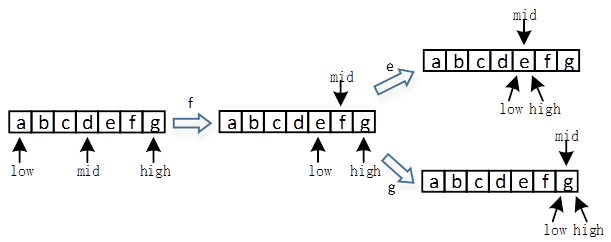   

### 9.3 画出对长度为10的有序表进行折半查找的判定树，并求其等概率时查找成功的平均查找长度。

> 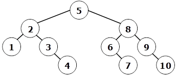    
>     
> ASLsucc=(1*1+2*2+3*4+4*3)/10=2.9    

### 9.4 假设按下述递归方法进行顺序表的查找：若表长≤10，则进行顺序查找，否则进行折半查找。试画出对表长n=50的顺序表进行上述查找时，描述该查找的判定树，并求出在等概率情况下查找成功的平均查找长度。

> 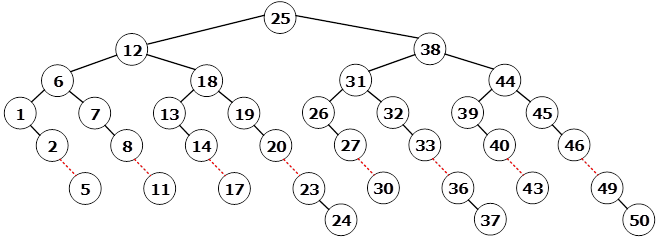    
>     
> ASLsucc=(1*1+2*2+3*4+(4+5+6+7+8)*8+9*3)/50=5.68    

### 9.5 下列算法为斐波那契查找的算法:

```c
int FibSearch(SqList r, KeyType K)
{
    j=1;
    while(fib(j)<n+1)
        j = j + 1;
        
    mid = n - fib(j-2) + 1; //若fib(j)=n+1，则mid=fib(j-1)
    f1 = fib(j-2);
    f2 = fib(j-3);
    
    found = FALSE;
    
    while((mid<>0) && !found)
        switch
        {
            case K=r[mid].key:
                found = TRUE;
            break;
            case K<r[mid].key:
                if(!f2)
                    mid = 0;
                else
                {
                    mid = mid-f2;
                    t = f1 - f2;
                    f1 = f2;
                    f2 = t;
                }
            break;
            case K>r[mid].key:
                if(f1=1)
                    mid = 0;
                else
                {
                    mid = mid + f2;
                    f1 = f1 - f2;
                    f2 = f2 – f1;
                }
            break;
        }

    if(found)
        return mid;
    else
        return 0;
}//FibSearch

其中fib(i)为斐波那契序列(参见9.1.2节注)。试画出对长度为20的有序表进行斐波那契查找的判定树，并求在等概率时查找成功的平均查找长度。
```

> 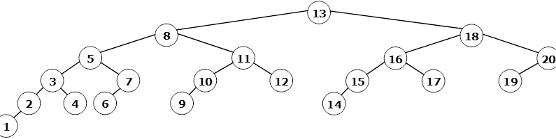    
>     
> ASLsucc=(1*1+2*2+3*4+4*7+5*5+6*1)/20=3.8    

### 9.6 假设在某程序中有如下一个if-then嵌套的语句

```c
if(C1)
  if(C2)
    if(C3)
      …
        if(Cn)
          S;
```

#### 其中Ci为布尔表达式。显然，只有当所有的C<sub>i</sub>都为TRUE时，语句S才能执行。假设t(i)为判别Ci是否为TRUE所需时间，p(i)为C<sub>i</sub>是TRUE的概率，试讨论这n个布尔表达式C<sub>i</sub>(i=1,2,…,n)应如何排列才能使该程序最有效地执行?

> 暂未理解题意。如有好的见解，欢迎提交Issues。

### 9.7 已知一个有序表的表长为8N，并且表中没有关键字相同的记录。假设按如下所述方法查找一个关键字等于给定值K的记录：先在第8,16,24,…,8K,…,8N个记录中进行顺序查找，或者查找成功，或者由此确定出一个继续进行折半查找的范围。画出描述上述查找过程的判定树，并求等概率查找时查找成功的平均查找长度。

> (N+1)/2+17/8    

### 9.8 已知含12个关键字的有序表及其相应权值为：
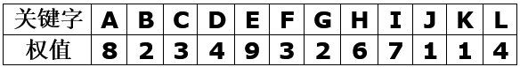
##### (1)试按次优查找树的构造算法并加适当调整画出由这12个关键字构造所得的次优查找树，并计算它的PH值;
##### (2)画出对以上有序表进行折半查找的判定树，并计算它的PH值。

> (1)次优查找树如下图，其PH=133    
> 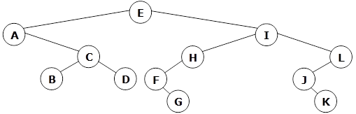    
>     
> (2)折半查找时：PH=156    

### 9.9 已知如下所示长度为12的表：(Jan, Feb, Mar, Apr, May, June, July, Aug, Sep, Oct, Nov, Dec)
##### (1)试按表中元素的顺序依次插入一棵初始为空的二叉排序树，画出插入完成之后的二叉排序树，并求其在等概率的情况下查找成功的平均查找长度。
##### (2)若对表中元素先进行排序构成有序表，求在等概率的情况下对此有序表进行折半查找时查找成功的平均查找长度。
##### (3)按表中元素顺序构造一棵平衡二叉排序树，并求其在等概率的情况下查找成功的平均查找长度。

> (1)ASLsucc=42/12=3.5    
> 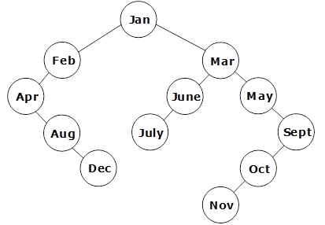    
>    
> (2)排序后的关键字如下，其平均查找长度为：ASLsucc=37/12=3.08     
> Apr, Aug, Dec, Feb, Jan, July, June, Mar, May, Nov, Oct, Sept     
>     
> (3)ASLsucc=38/12=3.17    
> 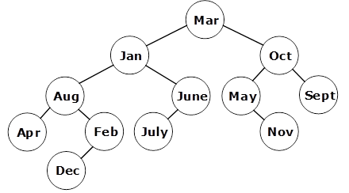    

### 9.10 可以生成如下二叉排序树的关键字的初始排列有几种？请写出其中的任意5个。
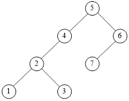

> 总共30种。    
>     
> 例：(5,6,7,4,2,1,3)(5,4,6,7,2,1,3)(5,4,2,6,7,1,3)(5,4,2,1,6,7,3)(5,4,2,1,3,6,7)。    

### 9.11 试推导含12个结点的平衡二叉树的最大深度，并画出一棵这样的树。

> 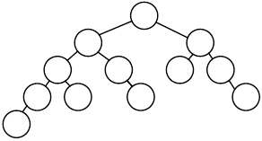    
> 深度为h的平衡二叉树中含有的最少结点数为Nh=Nh-1+Nh-2+1，由此可推出含有12个结点的平衡二叉树的最大深度为5.    

### 9.12 在B-树定义中，特性(3)的意图是什么？试思考：若把“┌m/2┐”改为“┌2m/3┐”或“┌m/3┐”是否可行？所得到的树结构和B-树有何区别？

> 特性3的意图在于保证B-树中结点空间的利用率不低于某个下限。改为┌2m/3┐不行，因为某结点因插入关键字而使其中关键字书目为m时，无法分裂成两个子树个数大于┌2m/3┐的结点；改为┌m/3┐是可行的，但它的结点利用空间利用率较低，不过分裂不如B-树那样频繁。

### 9.13 含9个叶子结点的3阶B-树中至少有多少个非叶子结点？含10个叶子结点的3阶B-树中至多有多少个非叶子结点？
> (1)至少4个    
> (2)至多8个    

### 9.14 试从空树开始，画出按以下次序向2-3树即3阶B-树中插入关键码的建树过程：20,30,50,52,60,68,70。如果此后删除50和68，画出每一步执行后2-3树的状态。

> 创建过程如下：    
> 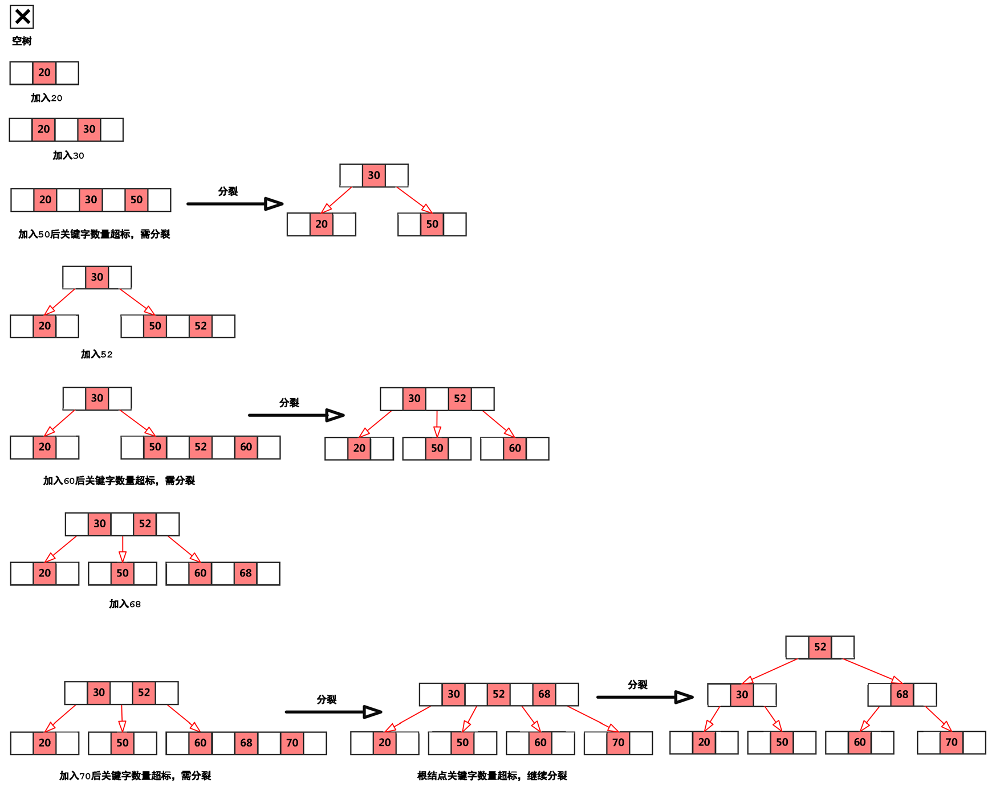

> 删除过程如下：    
> 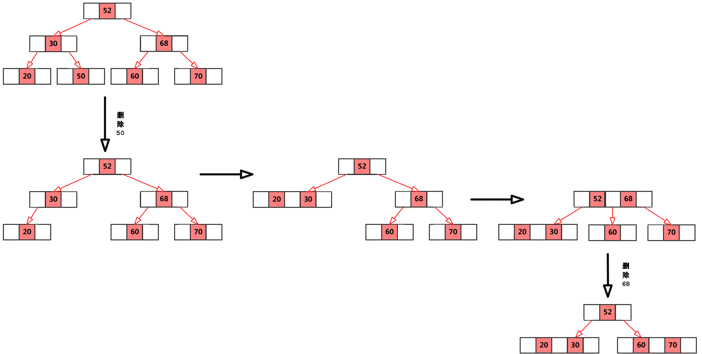

### 9.15 试证明：高度为h的2-3树中叶子结点的数目在2h-1与3h-1之间。

> 设2-3树每层结点关键字数量为n，则n=1或n=2。    
> 显然，当各结点关键字数量为1时，2-3树即为一颗完全二叉树，当其高度为h时，其叶子结点数目有最小值2h-1。    
> 同理，当树中各结点关键字数量为2时，可得高度为h的2-3树叶子结点数量为3h-1。    
> 故结论得证。（画图辅助证明会更直观）    

### 9.16 在含有n个关键码的m阶B-树中进行查找时，最多访问多少个结点？

> B-树中查找时，总是顺着树的分支往下走，且一次走一层，所以欲使访问果的结点最多，则只需使n个关键码构成的B-树有最大高度即可。     
> 对于含n个关键码的m阶B-树，其高度最多为：h=logt((n+1)/2)+1，t=┌m/2┐,故其最多访问的结点数为h。    

### 9.17 B+树和B-树的主要差异是什么?
> B-树：多路搜索树，每个结点存储M/2到M个关键字，非叶子结点存储指向关键字范围的子结点；所有关键字在整颗树中出现，且只出现一次，非叶子结点可以命中；    
> B+树：在B-树基础上，为叶子结点增加链表指针，所有关键字都在叶子结点中出现，非叶子结点作为叶子结点的索引；B+树总是到叶子结点才命中。    

### 9.18 试画一个对应于关键字集{program, programmer, programming,processor, or}的Trie树，对每个关键字从右向左取样，每次一个字母。

> 注：只写出了使用的字母    
> 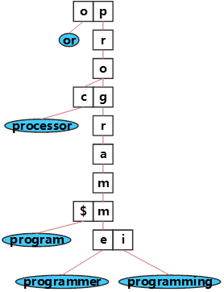    

### 9.19 选取哈希函数H(k)=(3k) MOD 11。用开放定址法处理冲突，di= i((7k) MOD 10+1) (i=1,2,3, …)。试在0~10的散列地址空间中对关键字序列(22, 41, 53, 46, 30, 13, 01, 67)造哈希表，并求等概率情况下查找成功时的平均查找长度。

> 由题意可知：    
>     
> H(22)=0;    
> H(41)=2;    
> H(53)=5;    
> H(46)=6;    
> H(30)=2; -> H(30)=3;    
> H(13)=6; -> H(13)=8;    
> H(01)=3; -> H(01)=0; -> H(01)=8; -> H(01)=5; -> H(01)=2; -> H(01)=10;    
> H(67)=3; -> H(67)=2; -> H(67)=1;    
>     
> 故构造函数的哈希表为：    
> 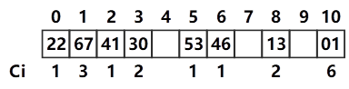    
>     
> 等概率时查找成功的平均查找长度为：    
>     ASL = (1+3+1+2+1+1+2+6)/8=17/8    

### 9.20 试为下列关键字建立一个装载因子不小于0.75的哈希表，并计算你所构造的哈希表的平均查找长度。
##### (ZHAO, QIAN, SUN, LI, ZHOU, WU, ZHENG, WANG, CHANG, CHAO, YANG, JIN)

> 这里使用线性探测开放定址法建立哈希表    
> 
> (1)确定哈希表长度    
> 由装载因子=记录数/表长得：表长≤12/0.75=16    
>     
> (2)将单词key转换为一个数字num，转换依据是：（还有其他转换依据）    
>>  int num = 0;    
>>  for(i=0; i<key.length; i++)    
>>  {    
>>      num = 37*num + (key[i]-‘A’+1);   //姓氏字串不会太长，可以遍历所有字符构造哈希值    
>>  }    
> 由此可得：    
> num(ZHAO)=1327982; num(QIAN)=873473; num(SUN)=26802; num(LI)=453;    
> num(ZHOU)=1328506; num(WU)=872; num(ZHENG)=49140780; num(WANG)=1166913;    
> num(CHANG)=6029601; num (CHAO)=162963; num (YANG)=1268219; num (JIN)=14037;     
>     
> (3)映射为哈希值，出现冲突时，顺次后移一位。    
> h(ZHAO)=1327982%16=14;    
> h(QIAN)=873473%16=1;    
> h(SUN)=26802%16=2;    
> h(LI)=453%16=5;    
> h(ZHOU)=1328506%16=10;    
> h(WU)=872%16=8;    
> h(ZHENG)=49140780%16 = 12;    
> h(WANG)=1166913%16=1;  h(WANG)=2; h(WANG)= 3;    
> h(CHANG)=6029601%16=1;  h(CHANG)=2;  h(CHANG)=3;  h(CHANG) = 4;    
> h(CHAO)=162963%16=3;  h(CHAO)=4;  h(CHAO)=5;  h(CHAO) = 6;    
> h(YANG)=1268219%16=11;    
> h(JIN)=14037%16=5;  h(JIN) = 6;  h(JIN) = 7;    
> 
> (4)构造的哈希查找表如下图：    
> 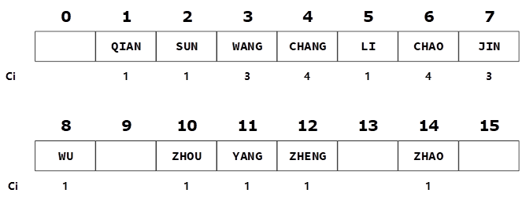
> 故平均查找长度为：ASL=(1+1+3+4+1+4+3+1+1+1+1+1)/12=1.8    

### 9.21 在地址空间为0~16的散列区中，对以下关键字序列构造两个哈希表:
##### (Jan, Feb, Mar, Apr, May, June, July, Aug, Sep, Oct, Nov, Dec)
##### (1)用线性探测开放定址法处理冲突；
##### (2)用链地址法处理。
##### 并分别求这两个哈希表在等概率情况下查找成功和不成功时的平均查找长度。
##### 设哈希函数为H(x)= └i/2┘，其中i为关键字中第一个字母在字母表中的序号。

> (1)处理冲突时采用序号增一的方式，结合题设可得：    
> H(Jan)=5;    
> H(Feb)=3;    
> H(Mar)=6;    
> H(Apr)=0;    
> H(June)=5; H(June)=6; H(June)=7;    
> H(May)=6; H(May)=7; H(May)=8;     
> H(July)=5; H(July)=6; H(July)=7; H(July)=8; H(July)=9;    
> H(Aug)=0; H(Aug)=1;    
> H(Sep)=9; H(Sep)=10;    
> H(Oct)=7; H(Oct)=8; H(Oct)=9; H(Oct)=10; H(Oct)=11;    
> H(Nov)=7; H(Nov)=8;  H(Nov)=9; H(Nov)=10; H(Nov)=11;  H(Nov)=12;    
> H(Dec)=2;    
> 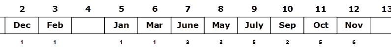    
> 
> 查找成功时，待查找字符串肯定是题设中给出的12个字串之一，故其查找成功的平均查找长度为：    
> ASL=(1+2+1+1+1+1+3+3+5+2+5+6)/12=31/12    
> 
> 查找失败时，待查找字符串可能是任意字串，它的首字母的取值范围是[0,13](1/2=0, 26/2=13)。    
> 当待查字串的哈希值为0时，需要与0,1,2,3,4比较5次才能确定不匹配；    
> 当待查字串的哈希值为1时，需要与1,2,3,4比较4次才能确定不匹配；    
> ...    
> 当待查字串的哈希值为4时，只需与4比较1次就能确定不匹配；    
> ...    
> 当待查字串的哈希值为12时，需要与12,13比较2次才能确定不匹配；    
> 当待查字串的哈希值为13时，只需与13比较1次就能确定不匹配；    
> 故其查找失败的平均长度为：    
> ASL=(5+4+3+2+1+9+8+7+6+5+4+3+2+1)/14=60/14    
>     
>     
> (2)按照平均查找长度的定义，公式中的Ci是指：“关键字与给定值比较的个数”则在用链地址处理冲突时，和“空指针”的比较不计在内。    
> H(Jan)=5; H(June)=5; H(July)=5;    
> H(Feb)=3;    
> H(Mar)=6; H(May)=6;    
> H(Apr)=0; H(Aug)=0;    
> H(Sep)=9;    
> H(Oct)=7; H(Nov)=7;    
> H(Dec)=2;    
>      
>     
> 查找成功时，待查找字符串肯定是题设中给出的12个字串之一：    
> 若给定字串是Apr，则需在0处比对一次；    
> 若给定字串是Aug，则需在0处比对两次；    
> ...    
> 若给定字串是July，则需在5处比对三次；    
> ...    
> 故其查找成功的平均查找长度为：    
> ASL=(1*7+2*4+3*1)/12=18/12    
>     
> 查找失败时，字串的哈希值取值范围仍为[0,13]：    
> 若给定字串的哈希值为0，则需与Apr、Aug分别比较2次后才能确定失配；    
> 若给定字串的哈希值为2，则需与Dec比较1次后就能确定失配；    
> ...    
> 若给定字串的哈希值为9，则需与Sep比较1次后就能确定失配。    
> 故查找失败的平均长度：    
> ASL=(2+1+1+3+2+2+1)/14=12/14    

### 9.22 已知一个含有1000个记录的表，关键字为中国人姓氏的拼音，请给出此表的一个哈希表设计方案，要求它在等概率情况下查找成功的平均查找长度不超过3。

> 暂未想到合适的解答。如有好的见解，欢迎提交Issues。

### 9.23 设有一个关键字取值范围为正整数的哈希表，空表项的值为-1，用开放定址法解决冲突。现有两种删除策略：一是将待删表项的关键字置为-1；二是将探测序列上的关键字顺序递补，即用探测序列上下一个关键字覆盖待删关键字，并将原序列上之后一个关键字置为-1。这两种方法是否可行？为什么？给出一种可行的方法，并叙述它对查找和插入算法所产生的影响。

> 两种方案都不行。前者切断了探测链，后者可能移动了非同义词。    
>     
> 一种可行的解决方案是：将待删除的关键字置为0，以区别于空表项。查找和插入算法都应相应地进行调整。    

### 9.24 某校学生学号由8位十进制数字组成:C1C2C3C4C5C6C7C8。C1C2为入学时年份的后两位；C3C4为系别：00~24分别代表该校的25个系；C5为0或1，0表示本科生，1表示研究生；C6C7C8为对某级某系某类学生的顺序编号：对于本科生，它不超过199，对于研究生，它不超过049，共有4个年级，四年级学生1996年入学。
##### (1)当在校生人数达极限情况时，将他们的学号散列到0~24999的地址空间，问装载因子是多少？
##### (2)求一个无冲突的哈希函数H1，它将在校生学号散列到。0~24999的地址空间。其簇聚性如何？
##### (3)设在校生总数为15000人，散列地址空间为,0~19999，你是否能找到一个(2)中要求的H1？若不能，试设计一个哈希函数H2及其解决冲突的方法，使得多数学号可只经一次散列得到（可设各系各年级本科生平均人数为130，研究生平均人数为20）。
##### (4)用算法描述语言表达H2，并写出相应的查找函数。

> 暂未想到合适的解答。如有好的见解，欢迎提交Issues。

## 二、算法设计题

### 9.25 假设顺序表按关键字自大至小有序，试改写教科书9.1.1节中的顺序查找算法，将监视哨设在高下标端。然后画出描述此查找过程的判定树，分别求出等概率情况下查找成功和不成功时的平均查找长度。

> [Question-9.25-main.c](▼习题测试文档-09/Question-9.25-main.c)

### 9.26 试将折半查找的算法改写成递归算法。
### 9.27 改写教科书9.1.2节中折半查找的算法，当r[i].key≤K＜r[i+1].key(i=1,2,…,n-1)时，返回i；当K<r[1].key时，返回0；当K≥r[n].key时，返回n。

> [Question-9.26~9.27-main.c](▼习题测试文档-09/Question-9.26~9.27-main.c)

### 9.28 试编写利用折半查找确定记录所在块的分块查找算法。并讨论在块中进行顺序查找时使用“监视哨”的优缺点，以及必要时如何在分块查找的算法中实现设置“监视哨”的技巧。

> [Question-9.28-main.c](▼习题测试文档-09/Question-9.28-main.c)

### 9.29 已知一非空有序表，表中记录按关键字递增排列，以不带头结点的单循环链表作存储结构，外设两个指针h和t，其中h始终指向关键字最小的结点，t则在表中浮动，其初始位置和h相同，在每次查找之后指向刚查到的结点。查找算法的策略是：首先将给定值K和t->key进行比较，若相等，则查找成功；否则因K小于或大于t->key而从h所指结点或t所指结点的后继结点起进行查找。
##### (1)按上述查找过程编写查找算法；
##### (2)画出描述此查找过程的判定树，并分析在等概率查找时查找成功的平均查找长度（假设表长为n，待查关键码K等于每个结点关键码的概率为1/n，每次查找都是成功的，因此在查找时，t指向每个结点的概率也为1/n）。

> [Question-9.29-main.c](▼习题测试文档-09/Question-9.29-main.c)

### 9.30 将9.28题的存储结构改为双向循环链表，且外设一个指针sp，其初始位置指向关键字最小的结点，在每次查找之后指向刚查到的结点。查找算法的策略是：首先将给定值K和sp->key进行比较，若相等，则查找成功；否则依K小于或大于sp->key继续从*sp的前驱或后继结点起进行查找。编写查找算法并分析等概率查找时查找成功的平均查找长度。

> [Question-9.30-main.c](▼习题测试文档-09/Question-9.30-main.c)

### 9.31 试写一个判别给定二叉树是否为二叉排序树的算法，设此二叉树以二叉链表作存储结构。且树中结点的关键字均不同。
### 9.32 已知一棵二叉排序树上所有关键字中的最小值为-max，最大值为max，又-max<x<max。编写递归算法，求该二叉排序树上的小于x且最靠近x的值a和大于x且最靠近x的值b。
### 9.33 编写递归算法，从大到小输出给定二叉排序树中所有关键字不小于x的数据元素。要求你的算法的时间复杂度为O(log2n+m)，其中n为排序树中所含结点数，m为输出的关键字个数。
### 9.34 试写一时间复杂度为O(log2n+m)的算法，删除二叉排序树中所有关键字不小于x的结点，并释放结点空间。其中n为树中所含结点数，m为被删除的结点个数。

> [Question-9.31~9.34-main.c](▼习题测试文档-09/Question-9.31~9.34-main.c)

### 9.35 假设二叉排序树以后继线索链表作存储结构，编写输出该二叉排序树中所有大于a且小于b的关键字的算法。
### 9.36 同9.35题的结构，编写在二叉排序树中插入一个关键字的算法。
### 9.37 同9.35题的结构，编写从二叉排序树中删除一个关键字的算法。

> [Question-9.35~9.37-main.c](▼习题测试文档-09/Question-9.35~9.37-main.c)

### 9.38 试写一算法，将两棵二叉排序树合并为一棵二叉排序树。
### 9.39 试写一算法，将一棵二叉排序树分裂为两棵二叉排序树，使得其中一棵树的所有结点的关键字都小于或等于x，另一棵树的任一结点的关键字均大于x。

> [Question-9.38~9.39-main.c](▼习题测试文档-09/Question-9.38~9.39-main.c)

### 9.40 在平衡二叉排序树的每个结点中增设一个lsize域，其值为它的左子树中的结点数加1。试写一时间复杂度为O(logn)的算法，确定树中第k小的结点的位置。

> [Question-9.40-main.c](▼习题测试文档-09/Question-9.40-main.c)

### 9.41 为B+树设计结点类型并写出算法，随机（而不是顺序）地查找给定的关键字K，求得它所在的叶子结点指针和它在该结点中的位置（提示：B+树中有两种类型的指针，结点结构也不尽相同，考虑利用记录的变体）。

> [Question-9.41-main.c](▼习题测试文档-09/Question-9.41-main.c)

### 9.42 假设Trie树上叶子结点的最大层次为h，同义词放在同一叶子结点中，试写在Trie树中插入一个关键字的算法。
### 9.43 同9.42的假设，试写在Trie树中删除一个关键字的算法。

> [Question-9.42~9.43-main.c](▼习题测试文档-09/Question-9.42~9.43-main.c)

### 9.44 已知某哈希表的装载因子小于1，哈希函数H(key)为关键字(标识符)的第一个字母在字母表中的序号，处理冲突的方法为线性探测开放定址法。试编写一个按第一个字母的顺序输出哈希表中所有关键字的算法。

> [Question-9.44-main.c](▼习题测试文档-09/Question-9.44-main.c)

### 9.45 假设哈希表长为m，哈希函数为H(x)，用链地址法处理冲突。试编写输入一组关键字并建造哈希表的算法。

> [Question-9.45-main.c](▼习题测试文档-09/Question-9.45-main.c)

### 9.46 假设有一个1000×1000的稀疏矩阵，其中1%的元素为非零元素，现要求用哈希表作存储结构。试设计一个哈希表并编写相应算法，对给定的行值和列值确定矩阵元素在哈希表上的位置。请将你的算法与在稀疏矩阵的三元组表存储结构上存取元素的算法（不必写出）进行时间复杂度的比较。

> [Question-9.46-main.c](▼习题测试文档-09/Question-9.46-main.c)


