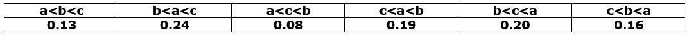
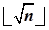

# 第10章 内部排序

## 一、基础知识题

### 10.1 以关键码序列(503,087,512,061,908,170,897,275,653,426)为例，手工执行以下排序算法，写出每一趟排序结束时的关键码状态:
#### (1)直接插入排序；
#### (2)希尔排序(增量d[1]=5)；
#### (3)快速排序；
#### (4)堆排序；
#### (5)归并排序
#### (6)基数排序。

### 10.2 若对下列关键字序列按教科书10.3节和10.5节中所列算法进行快速排序和归并排序，分别写出三次调用过程Partition和过程Merge后的结果。
#### (Tim,Kay,Eva,Roy,Dot,Jon,Kim,Ann,Tom,Jim,Guy,Amy)

### 10.3 试问在10.1题所列各种排序方法中，哪些是稳定的？哪些是不稳定的？并为每一种不稳定的排序方法举出一个不稳定的实例。

### 10.4 试问：对初始状态如下（长度为n）的各序列进行直接插入排序时，至多需进行多少次关键字间的比较（要求排序后的序列按关键字自小至大顺序有序）？
#### (1)关键字（自小至大）顺序有序：(key1<key2<…<keyn)
#### (2)关键字（自大至小）逆序有序：(key1>key2>…>keyn)
#### (3)序号为奇数的关键字顺序有序，序号为偶数的关键字顺序有序：(key1<key3<…,  key2<key4…)
#### (4)前半个序列中的关键字顺序有序，后半个序列中的关键字逆序有序：(key1<key2<…<key└n/2┘,  key└n/2┘+1>…keyn)

### 10.5 假设我们把n个元素的序列{a1,a2,…,an}中满足条件ak<max{at}(1≤t<k)的元素ak称为“逆序元素”。若在一个无序序列有一对元素ai>aj(i<j)，试问当将ai和aj相互交换之后（即序列由{…ai…aj…}变为{…aj…ai…}），该序列中逆序元素的个数会增加吗？为什么？

### 10.6 奇偶交换排序如下所述：第一趟对所有奇数i，将a[i]和a[i+1]进行比较；第二趟对所有的偶数i，将a[i]和a[i+1]进行比较，若a[i]>a[i+1]，则将两者交换；第三趟对奇数i；第四趟对偶数i，…，依次类推直至整个序列有序为止。
#### (1)试问这种排序方法的结束条件是什么？
#### (2)分析当初始序列为正序或逆序两种情况下，奇偶交换排序过程中所需进行的关键字比较的次数。

### 10.7 不难看出，对长度为n的记录序列进行快速排序时，所需进行的比较次数依赖于这n个元素的初始排列。
#### (1)n=7时在最好情况下需进行多少次比较？请说明理由。
#### (2)对n=7给出一个最好情况的初始排列实例。

### 10.8 试证明：当输入序列已经呈现为有序状态时，快速排序的时间复杂度为O(n2)。

### 10.9 若将快速排序的一次划分改写为如下形式，重写快速排序的算法，并讨论对长度为N的记录序列进行快速排序时在最好的情况下所需进行的关键字间比较的次数（包括三者求中）。
```c
int partition(SqList &L, int low, int high, bool ci, bool cj)
{
    int i, j, m;
    KeyType x;
    i = s;
    j = t;
    m = (s+t)%2;
    x = Midkey(s, m, t);//三者取中值
    ci = cj = FALSE;

    while (i<j)
    {
        while((i<j) && (r[i].key<=x))
        {
            i = i + 1;
            if(r[i].key<r[i-1].key)
                r[i]↔r[i-1];
            ci = TRUE;
        }//while

        while((j>i) && (r[j].key>x))
        {
            j = j - 1;

            if(r[j].key>r[j+1].key)
            {
                r[j]↔r[j+1];
                cj = TRUE;
            }//if

            if(i<j)
            {
                r[i]↔r[j];
                if((i>s) && (r[i].key<r[i-1].key))
                    ci = TRUE;
                if((j<t) && (r[j].key>r[j+l].key))
                    cj = TRUE;
            }//if
        }//while
    }//while

    return i;
}//partition

```
### 10.10 阅读下列排序算法，并与已学算法相比较，讨论算法中基本操作的执行次数。
```c
void sort(SqList &r, int n)
{
    i=1;
    while (i<n-i+1)
    {
        min = max = 1;

        for(j=i+1; j<=n-i+1; ++j)
        {
            if(r[j].key<r[min].key)
                min = j;
            else if(r[j].key>r[max].key)
                max = j;
        }//for

        if(min!=i)
            r[min]↔r[i];

        if(max!=n-i+1)
        {
            if(max==i)
                r[min]↔r[n-i+1];
            else
                r[max]↔r[n-i+1];
        }//if

        i++;
    }//while
}//sort
```

### 10.11 试问：按锦标赛排序的思想，决出八名运动员之间的名次排列，至少需编排多少场次的比赛（应考虑最坏的情况）？

### 10.12 判别以下序列是否为堆（小顶堆或大顶堆）。如果不是，则把它调整为堆（要求记录交换次数最少）。
#### (1)(100, 86, 48, 73, 35, 39, 42, 57, 66, 21);
#### (2)(12, 70, 33, 65, 24, 56, 48, 92, 86, 33);
#### (3)(103, 97, 56, 38,  66, 23, 42, 12, 30, 52, 06, 20);
#### (4)(05, 56, 20, 23, 40, 38, 29, 61, 35, 76, 28, 100)。

### 10.13 一个长度为n的序列，若去掉其中少数k(k<<n)个记录后，序列是按关键字有序的，则称为近似有序序列。试对这种序列讨论各种简单排序方法的时间复杂度。

### 10.14 假设序列由n个关键字不同的记录构成，要求不经排序而从中选出关键字从大到小顺序的前k(k<<n)个记录，试问如何进行才能使所作的关键字间比较次数达到最小？

### 10.15 对一个由n个关键字不同的记录构成的序列，你能否用比2n-3少的次数选出这n个记录中关键字取最大值和关键字取最小值的记录？若能，请说明如何实现？在最坏情况下至少进行多少次比较？

### 10.16 已知一个含有n个记录的序列，其关键字均为介于0和n2之间的整数。若利用堆排序等方法进行排序，则时间复杂度为O(nlogn)。如果将每个关键字Ki认作Ki =Ki1n+Ki2，其中Ki1和Ki2都是范围[0, n)中的整数，则利用基数排序只需用O(n)的时间。推广之，若整数关键字的范围为[0, nk)，则可得到只需时间O(kn)的排序方法，试讨论如何实现之。

### 10.17 已知一个单链表由3000个元素组成，每个元素是一整数，其值在1~1000000之间。试考察在第10章给出的几种排序方法中，哪些方法可用于解决这个链表的排序问题？哪些不能？简述理由。

### 10.18 在进行多关键字排序的两种方法中，试思考在什么条件下MSD法比LSD法效率更高？

### 10.19 假设某大旅店共有5000个床位，每天需根据住宿旅客的文件制造一份花名册，该名册要求按省（市）的次序排列，每一省（市）按县（区）排列，又同一县（区）的旅客按姓氏排列。请你为旅店的管理人员设计一个制作这份花名册的方法。

### 10.20 已知待排序的三个整数a，b和c(a≠b≠c≠a)可能出现的六种排列情况的概率不等，且如下表所示：

#### 试为该序列设计一个最佳排序方案， 使排序过程中所需进行的关键字间的比较次数的期望值达到最小。

### 10.21 分别利用折半插入排序法和2-路归并排序法对含4个记录的序列进行排序，画出描述该排序过程的判定树，并比较它们所需进行的关键字间的比较次数的最大值。

### 10.22 归并插入排序是对关键字进行比较次数最少的一种内部排序方法，它可按如下步骤进行（假设待排序元素存放在数组x[1..n]中）：
#### (1)另开辟两个大小为┏n/2┓的数组small和large。从i=1到n-1，对每个奇数的i，比较x[i]和x[i+1]，将其中较小者和较大者分别依次存入数组small和large中（当n为奇数时，small[┏n/2┓]=x[n]）；
#### (2)对数组large[1..┗n/2┛]中元素进行归并插入排序，同时相应调整small数组中的元素，使得在这一步结束时达到large[i]<large[i+l]，i=1，2，…，┗n/2┛-1，small[i]<large[i]，i=1，2，…，┗n/2┛；
#### (3)将small[1]传送至x[1]中，将large[1]至large[┗n/2┛]依次传送至x[2]至x[┗n/2┛+1]中；
#### (4)定义一组整数int[i]=(2i+1+(-1)i)/3，i = 1，2，…，t-1，直至int[t]>┗n/2┛+1，利用折半插入依次将small[int[i+1]]至small[int[i]+1]插入至x数组中去。例如，若n=21，则得到一组整数int[1]=1，int[2]=3，int[3]=5，int[4]=11，由此small数组中元素应按如下次序：small[3]，small[2]，small[5]，small[4]，small[11]，small[10]，…，small[6]，插入到x数组中去。
#### 试以n=5和n=11手工执行归并插入排序，并计算排序过程中所作关键字比较的次数。

## 二、算法设计题

### 10.23 试以L.r[k+1]作为监视哨改写教科书10.2.1节中给出的直接插入排序算法。其中，L.r[1..k]为待排序记录且k<MAXSIZE。

[Question-10.23-main.c](▼习题测试文档-10/Question-10.23-main.c)

### 10.24 试编写教科书10.2.2节中所述2-路插入排序的算法。

[Question-10.24-main.c](▼习题测试文档-10/Question-10.24-main.c)

### 10.25 试编写教科书10.2.2节中所述链表插入排序的算法。

[Question-10.25-main.c](▼习题测试文档-10/Question-10.25-main.c)

### 10.26 如下所述改写教科书10.3节中所述起泡排序算法：将1.4.3节的算法中用以起控制作用的布尔变量change改为一个整型变量，指示每一趟排序中进行交换的最后一个记录的位置，并以它作为下一趟起泡排序循环终止的控制值。

[Question-10.26-main.c](▼习题测试文档-10/Question-10.26-main.c)

### 10.27 编写一个双向起泡的排序算法，即相邻两遍向相反方向起泡。

[Question-10.27-main.c](▼习题测试文档-10/Question-10.27-main.c)

### 10.28 修改10.27题中要求的算法，请考虑如何避免将算法写成两个并在一起的相似的单向起泡的算法段。

[Question-10.28-main.c](▼习题测试文档-10/Question-10.28-main.c)

### 10.29 按10.6题所述编写奇偶交换排序的算法。

[Question-10.29-main.c](▼习题测试文档-10/Question-10.29-main.c)

### 10.30 按下述原则编写快排的非递归算法：
#### (1)一趟排序之后，若子序列已有序（无交换），则不参加排序，否则先对长度较短的子序列进行排序，且将另一子序列的上、下界入栈保存；
#### (2)若待排记录数≤3，则不再进行分割，而是直接进行比较排序。

>(1)已有序的序列不再参与排序。    
>    
>(2)当序列记录≤3时候用冒泡排序。    

[Question-10.30-main.c](▼习题测试文档-10/Question-10.30-main.c)

### 10.31 编写算法，对n个关键字取整数值的记录序列进行整理，以使所有关键字为负值的记录排在关键字为非负值的记录之前，要求：
#### (1)采用顺序存储结构，至多使用一个记录的辅助存储空间；
#### (2)算法的时间复杂度为O(n)；
#### (3)讨论算法中记录的最大移动次数。

[Question-10.31-main.c](▼习题测试文档-10/Question-10.31-main.c)

### 10.32 荷兰国旗问题：设有一个仅由红、白、蓝三种颜色的条块组成的条块序列。请编写一个时间复杂度为O(n)的算法，使得这些条块按红、白、蓝的顺序排好，即排成荷兰国旗图案。

[Question-10.32-main.c](▼习题测试文档-10/Question-10.32-main.c)

### 10.33 试以单链表为存储结构实现简单选择排序的算法。

[Question-10.33-main.c](▼习题测试文档-10/Question-10.33-main.c)

### 10.34 已知(k1,k2,…,kp)是堆，则可以写一个时间复杂度为O(logn)的算法将(k1,k2,…,kp,kp+1)调整为堆。试编写“从p=1起，逐个插入建堆”的算法，并讨论由此方法建堆的时间复杂度。

[Question-10.34-main.c](▼习题测试文档-10/Question-10.34-main.c)

### 10.35 假设定义堆为满足如下性质的完全三叉树:(1)空树为堆；(2)根结点的值不小于所有子树根的值，且所有子树均为堆。编写利用上述定义的堆进行排序的算法，并分析推导算法的时间复杂度。

[Question-10.35-main.c](▼习题测试文档-10/Question-10.35-main.c)

### 10.36 可按如下所述实现归并排序:假设序列中有k个长度为≤l的有序子序列。利用过程merge(参见教科书10.5节)对它们进行两两归并，得到┏k/2┓个长度≤2l的有序子序列，称为一趟归并排序。反复调用一趟归并排序过程，使有序子序列的长度自l=1开始成倍地增加，直至使整个序列成为一个有序序列。试对序列实现上述归并排序的递推算法，并分析你的算法的时间复杂度。

[Question-10.36-main.c](▼习题测试文档-10/Question-10.36-main.c)

### 10.37 采用链表存储结构，重做10.36题。

[Question-10.37-main.c](▼习题测试文档-10/Question-10.37-main.c)

### 10.38 2-路归并排序的另一策略是，先对待排序序列扫描一遍，找出并划分为若干个最大有序子列，将这些子列作为初始归并段。试写一个算法在链表结构上实现这一策略。

[Question-10.38-main.c](▼习题测试文档-10/Question-10.38-main.c)

### 10.39 已知两个有序序列(a1,a2,…,am)和(am+1,am+2,…,an)，并且其中一个序列的记录个数少于s，且s=。试写一个算法，用O(n)时间和O(1)附加空间完成这两个有序序列的归并。

[Question-10.39-main.c](▼习题测试文档-10/Question-10.39-main.c)

### 10.40 假设两个序列都各有至少s个记录，重做10.39题。

> 暂未理解题意。如有好的见解，欢迎提交Issues。

### 10.41 假设有1000个关键字为小于10000的整数的记录序列，请设计一种排序方法，要求以尽可能少的比较次数和移动次数实现排序，并按你的设计编出算法。

[Question-10.41-main.c](▼习题测试文档-10/Question-10.41-main.c)

### 10.42 序列的“中值记录”指的是：如果将此序列排序后，它是第┌n/2┐个记录。试写一个求中值记录的算法。

[Question-10.42-main.c](▼习题测试文档-10/Question-10.42-main.c)

### 10.43 已知记录序列a[1..n]中的关键字各不相同，可按如下所述实现计数排序：另设数组c[1..n]，对每个记录a[i]，统计序列中关键字比它小的记录个数存于c[i]，则c[i]=0的记录必为关键字最小的记录，然后依c[i]值的大小对a中记录进行重新排列，试编写算法实现上述排序方法。

[Question-10.43-main.c](▼习题测试文档-10/Question-10.43-main.c)

### 10.44 假设含n个记录的序列中，其所有关键字为值介于v和w之间的整数，且其中很多关键字的值是相同的。则可按如下方法进行排序：另设数组number[v..w]且令number[i]统计关键字取整数i的记录数，之后按number重排序列以达到有序。试编写算法实现上述排序方法，并讨论此种方法的优缺点。

[Question-10.44-main.c](▼习题测试文档-10/Question-10.44-main.c)

### 10.45 试编写算法，借助“计数”实现基数排序。

[Question-10.45-main.c](▼习题测试文档-10/Question-10.45-main.c)

### 10.46 序列b的每个元素是一个记录，每个记录占的存储量比其关键字占的存储量大得多，因而记录的移动操作是极为费时的。试写一个算法，将序列b的排序结果放入序列a中，且每个记录只拷贝一次而无其他移动。你的算法可以调用第10章中给出的任何排序算法。思考：当记录存于链表中时，若希望利用快速排序算法对关键字排序，从而最后实现链表的排序，如何模仿上述方法实现？

[Question-10.46-main.c](▼习题测试文档-10/Question-10.46-main.c)
