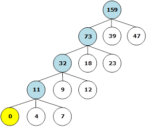
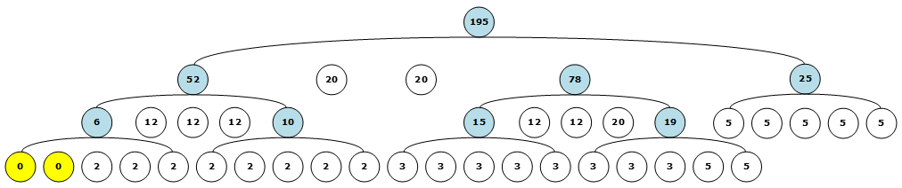

# 第11章 外部排序

## 一、基础知识题

### 11.1 假设某文件经内部排序得到100个初始归并段，试问:
#### (1)若要使多路归并三趟完成排序，则应取归并的路数至少为多少？
#### (2)假若操作系统要求一个程序同时可用的输入、输出文件的总数不超过13，则按多路归并至少需几趟可完成排序？如果限定这个趟数？则可取的最低路数是多少？

> (1) 至少取5路进行归并。    
> (2) 每次取12路进行归并，则至少需2趟才可完成排序。如果限定归并趟数为2，则对于100个初始归并段，取10路归并即可。    

### 11.2 假设一次I/O的物理块大小为150，每次可对750个记录进行内部排序，那么，对含有150000个记录的磁盘文件进行4-路平衡归并排序时，需进行多少次I/O？

> 150000个记录存放在150000/150=1000个物理块上，每次可对750/150=5个物理块的记录进行内部排序，即经过内部排序后，可得到1000/5=200个初始归并段。200个初始归并段需要经过┌log4200┐=4趟4-路平衡归并排序。所以，总的I/O次数为：1000×2+1000×2×4=10000。

### 11.3 “败者树”中的“败者”指的是什么？若利用败者树求k个数中的最大值，在某次比较中得到a>b，那么谁是败者？“败者树”与“堆”有何区别？
> “败者”指当前筛选中不符合要求的元素。    
>     
> 求最大值时，每次比较中较小的元素为败者，即b是败者。    
>     
> “败者树”与“堆”的区别在于：败者树是由参加比较的n个元素作为叶子结点而得到的完全二叉树，而“堆”则是n个元素Ri(i=1,2,…,n)的序列，它满足下列性质：Ri≤R2i，且Ri≤R2i+1(1≤i≤[n/2])。    
> 由于这个性质中下标i和2i，2i+1的关系恰好和完全二叉树中第i个结点和它的孩子结点的序号之间的关系一致，则堆可看成是含n个结点的完全二叉树。    

### 11.4 手工执行算法k-merge，追踪败者树变化过程。假设初始归并段为
#### (10, 15, 16, 20, 31, 39, +∞);
#### (9, 18, 20, 25, 36,48, +∞);
#### (20, 22, 40, 50, 67, 79, +∞);
#### (6, 15, 25, 34, 42, 46, +∞);
#### (12, 37, 48, 55, +∞);
#### (84, 95, +∞)

> // 抽时间再画

### 11.5 为什么置换-选择排序能得到平均长度为2w的初始归并段？能否依置换-插入或置换-交换等策略建立类似的排序方法？

> 暂未想到合适的证明过程。如有好的方案，欢迎提交Issues。

### 11.6 设内存有大小为6个记录的区域可供内部排序之用，文件的关键字序列为(51, 49, 39, 46, 38, 29, 14, 61, 15, 30, 1, 48, 52, 3, 63, 27, 4, 13, 89, 24, 46, 58, 33, 76)。试列出：
#### (1)用第10章中的内部排序方法求出的初始归并段；
#### (2)用置换-选择排序得出的初始归并段，并写出FI，W和FO的变化过程；
#### (3)用上面给出的数据手工执行算法repl-selection。

> (1) 内部排序法：    
> RUN1：29,38,39,46,49,51    
> RUN2：1,14,15,30,48,61    
> RUN3：3,4,13,27,52,63    
> RUN4：24,33,46,58,76,89    
>     
> (2) 置换-选择排序：    
> RUN1：29,38,39,46,49,51,61    
> RUN2：1,3,14,15,27,30,48,52,63,89    
> RUN3：4,13,24,33,46,58,76    
>     
> (3) // 抽时间再画    

### 11.7 试问输入文件在哪种状态下经由置换-选择排序得到的初始归并段长度最长？其最长的长度是多少？

> 记录关键字均非递减排列时，可得到最长的初始归并段，其长度为所有记录总数。

### 11.8 试问输入文件在哪种状态下经由置换-选择排序得到的初始归并段长度最短？其最短的长度是多少？
> 记录关键字均非递增排列时，可得到最短的初始归并段，其长度为1。

### 11.9 假若一个经由置换-选择排序得到的输出文件再次进行置换-选择排序，试问该文件将产生什么变化？

> 由于文件经置换-选择排序后记录的关键字已呈非递减排列，故再次进行置换-选择排序文件将保持原样。

### 11.10 在输入文件为逆序的情况下，由11.13题所描述的自然选择排序得到的初始归并段的平均长度为多少？

> 关键字均为逆序时，平均长度与缓冲区长度相同。

### 11.11 已知某文件经过置换-选择排序之后，得到长度分别为47, 9, 39, 18, 4, 12, 23和7的八个初始归并段。试为3-路平衡归并设计一个读写外存次数最少的归并方案，并求出读写外存的次数。
> 设归并路数为k，归并段个数为m，则(m-1)MOD(k-1)=1，故需要增加k-(m-1)MOD(k-1)-1=1个长度为0的“虚段”。    
>     
> 归并方案如下：    
>         
>     
> 总I/O次数为：    
> [(4+7)×4+(9+12)×3+(18+23)×2+(39+47)×1]×2=550    

### 11.12 已知有31个长度不等的初始归并段，其中8段长度为2，8段长度为3，7段长度为5，5段长度为12，3段长度为20（单位均为物理块）。请为此设计一个5-路最佳归并方案，并计算总的（归并所需的）读/写外存的次数。

> 设归并路数为k，归并段个数为m，则(m-1)MOD(k-1)=2，故需要增加k-(m-1)MOD(k-1)-1=2个长度为0的“虚段”。    
>     
> 归并方案如下    
> 
>     
> 总I/O次数为：    
> [(8×2+8×3+5×2)×3+(5×5+5×12+20)×2+(2×20)×1]×2=800    

## 二、算法设计题

### 11.13 假设在进行置换-选择排序时，可另开辟一个和工作区的容量相同的辅助存储区（称储备库）。当输入的记录关键字小于刚输出的MINIMAX记录时，不将它存入工作区，而暂存在储备库中，接着输入下一记录，依次类推，直至储备库满时不再进行输入，而只从工作区中选择记录输出直至工作区空为止，至此得到一个初始归并段。之后，再将储备库中记录传送至工作区，重新开始选择排序。这种方法称自然选择排序。一般情况下可求得比置换-选择排序更长的归并段。
#### (1)试对11.4节中文件例子进行自然选择排序，求初始归并段。
#### (2)编写自然选择排序的算法。

> (1) 可以得到两个初始归并段：    
> RUN1：29,38,39,46,48,49,51,52,61,63    
>RUN2：1,3,4,13,14,15,24,27,30,33,46,58,76,89    
>    
> (2) 自然选择法排序算法：    
>     
>[Question-11.13-main.c](▼习题测试文档-11/Question-11.13-main.c)

