# 第12章 文件

## 一、基础知识题

### 12.1 试比较顺序文件、索引文件和索引顺序文件各有什么特点。

> (1) 顺序文件：物理记录的顺序和逻辑记录的顺序一致。     
> 优点：存储利用率高，连续存取速度快，主要用于只进行顺序存取、批量修改的情况。     
> 缺点：随机增删比较费时。     
>      
> (2) 索引文件（关键字不一定有序）：是一类包括文件数据区和索引表两大部分的文件。     
> 优点：主文件关键字无序，适合随机存取，不适合顺序存取，查找、追加和删除记录较为方便。     
> 缺点：增加了索引区（稠密索引）和溢出区空间，空间利用率低。创建和维护索引较费时。     
>      
> (3) 索引顺序文件：主文件按关键字（索引）有序排列。     
> 优点：适合随机存储和顺序存储，且关键字索引为稀疏索引，占用存储空间较小。     
> 缺点：维护索引较为耗时。     

### 12.2 已知下列ISAM文件：

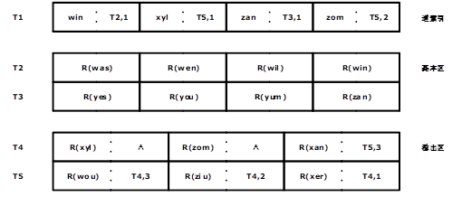

#### 试叙述在文件中查找记录R(xan)和R(xzi)的过程。

> (1)  查找R(xan)     
> 道索引：T1,1<R(xan)<=T1,2，转到溢出区T5,1开始查找→溢出区：T4,3满足条件。     
>      
> (2) 查找R(xzi)     
> 道索引：T1,2<R(xzi)<=T1,3，转到基本区T3,1开始查找→基本区：R(xzi)<T3,1，文件中不存在R(xzi)。     

### 12.3 试画出在下图所示文件的状态下，插入R89，R91，删除R99，R92之后的文件状态。

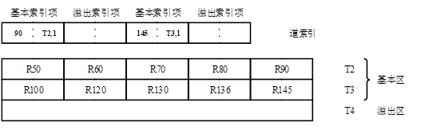

> (1) 插入89    
> 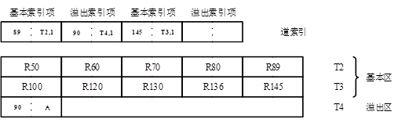    
>    
> (2) 插入91    
> 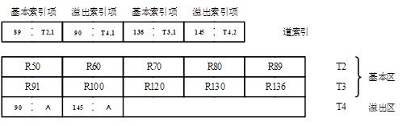    
>    
> (3) 删除99    
>     
> (4) 删除92    

### 12.4 直接存取文件为什么不用教科书9.3.3节中给出的链地址法存储结构而要按桶散列？桶的大小m是如何确定的？

> (1)按桶散列可减小内存开销，提高内存利用率，而且查找效率不至于太低。    
> (2)直接文件中存在如下关系：    
> 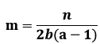    
> 其中，a为存取桶数的期望值，n为文件的记录数，b为桶数，m为桶容量。    

### 12.5 假设物理块（桶）大小为100，若要求对含有30000个记录的直接存取文件进行一次按关键字查询时，读外存次数的平均值不超过2，则问该直接存取文件应设多大？

> 在直接文件中存在以下关系：    
>     
> 其中，a为存取桶数的期望值，n为文件的记录数，b为桶数，m为桶容量。    
> 由此可得：    
> 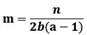    
> 由题意可得：a<=2；则：    
> 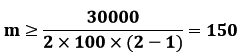    

### 12.6 试叙述在下图所示文件中查找“计算机”专业选修“丙”课程的学生名单的过程。一般来说，查询条件为两个关键字条件的“与”时，按哪个次关键字的链查找较好？

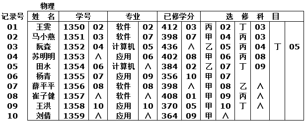

> (1)根据索引文件的不同组织方式，可采用不同的查找过程。     
> ①多重表文件。     
> 分别顺着次关键字“计算机”和“丙”的指针遍历索引，判断其中是否有相同的记录号。     
> ②倒排文件。     
> 将次关键字“计算机”和“丙”中的记录号做“交”的集合运算即可。     
>      
> (2)查询条件为两个关键字条件的“与”时，按倒排文件次关键字的链查找较好。     

### 12.7 简单比较文件的多重表和倒排表组织方式各有什么优缺点。

> (1) 多重表文件：记录按主关键字的顺序构成一个串联文件，并建立主关键字的索引；对每一个次关键字项建立次关键字索引。所有具有同一关键字的记录构成一个链表。     
> 优点：易于构造，也易于修改。如果不要求保持链表的某种次序，则插入一个新纪录是容易的，此时可将记录插在链表的头指针之后，     
> 缺点：删除一个记录较繁琐，需在每个次关键字的链表中删去该记录。     
>      
> (2) 倒排文件：用记录的非主属性值（也叫副键）来查找记录而组织的文件     
> 优点：检索记录较快。     
> 缺点：维护困难，在同一索引表中，不同关键字记录数不同，各倒排表的长度不等，同一倒排表中各项长度也不等。     

### 12.8 请为图书馆中如下所示的部分目录建立一个倒排文件。要求该文件允许用户按书名查找或按作者查找或按分类查找。现有的外存为磁盘，主文件按索引顺序组织，每个柱面有6道，设柱面溢出区，溢出区占2道。

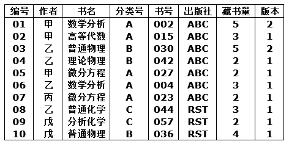

### 若相继插入下列记录，文件将发生什么变化？

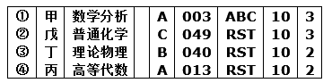

> 以书号作为主关键字对文件记录排序：    
> 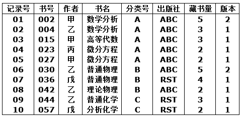    
>     
> (1) 分别按书名、作者和分类建立倒排表：    
> 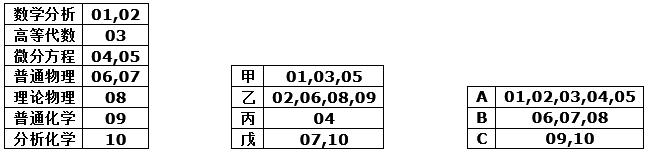    
>    
> (2) 插入记录前文件在某一柱面上的状态为如下图：    
> 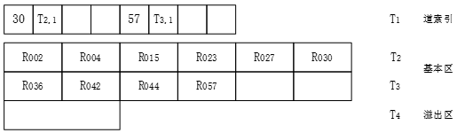    
> 插入第①条记录：    
> 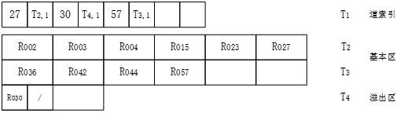    
> 插入第②、③条记录：    
> 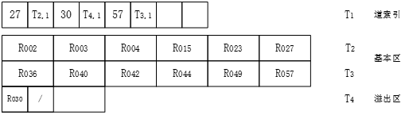     
> 插入第④条记录：    
> 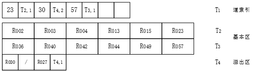     

### 12.9 试综述文件有哪几种常用的组织方式？它们各有什么特点？

> 文件分为顺序文件、索引文件、散列文件。     
>     
>> 顺序文件又称连续文件，其优缺点分别为：     
>> 优点：处理速度快，存储空间利用率高，在任何媒体上实现。     
>> 缺点：需要对事务己求预先排序，插入记录麻烦，要检索整个记录。     
>     
>> 索引文件分为索引顺序文件和索引非顺序文件，其优缺点分别为：     
>> 优点：可顺序处理，也可随机处理，记录追加、插入方便，查找速度较快。     
>> 缺点：增加索引区和溢出区空间，不能用于多码检索。     
>
>> 散列文件又称直接文件、哈希文件，其优缺点分别为：     
>> 优点：存取速度快，记录追加、删除容易。     
>> 缺点：存储空间利用率低，且不能进行顺序存取，只能按关键字随机存取；询问方式限于简单询问；在经过多次插入、删除后，可能造成文件结构不合理，需要重新组织文件。     

### 12.10 假设某个有3000张床位的旅店需为投宿的旅客建立一个便于管理的文件，每个记录是一名旅客的身份和投宿情况，其中旅客的身份证号码（15位十进制数字）可作为主关键字。为了来访客人查询方便，还需建立姓名、投宿日期、从哪儿来等次关键字项索引。请为此文件确定一种组织方式（如：主文件如何组织、各次关键字项索引如何建立等）。

> 用索引文件存取    

## 二、算法设计题

### 12.11 设主文件中每个记录含有账号和余额两个域，事务文件含有账号、存取标记和数额三个域。试写一个批量处理算法，产生更新后的新主文件，如下图所示。各文件均按账号由小到大的顺序排序；你的算法中必须包括检查输入数据错误的能力：将错误记录输出而又不影响后面其他记录的处理。

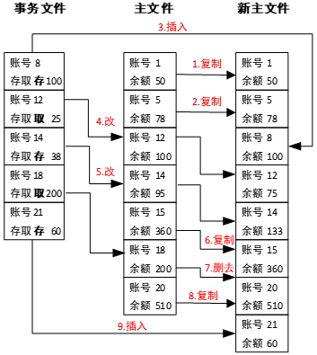

> [Question-12.11-main.c](▼习题测试文档-12/Question-12.11-main.c)

