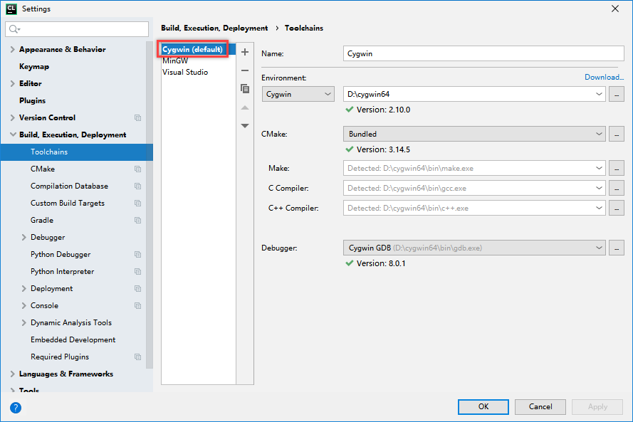
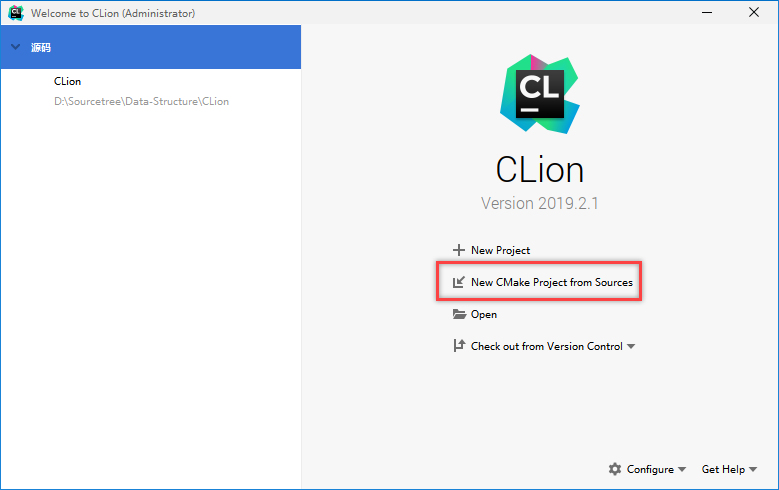
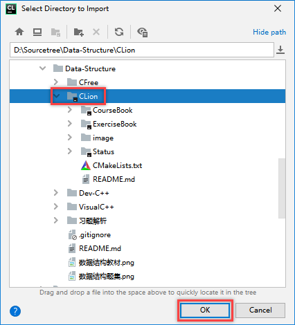
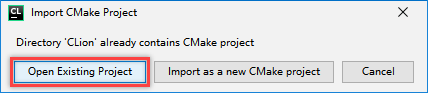

# 《数据结构》课本源码与习题解析

## 源码语言

> **C语言** [兼容到[C89/C90](https://baike.baidu.com/item/c89/22224985?fr=aladdin)]    

## 测试环境

> **CLion** [2019]    
> **Cygwin64** [gcc-7.3.0]    

## 使用说明

1. 确保 **CLion** 的工具链已配置完毕（配置方式可自行搜索）    

2. 启动 **CLion** ，选择"New CMake Project from Sources"    

3. 选择待启动的项目（CLion版本的源码）    

4. 选择"Open Existing Project"，打开存在的项目，等待加载完成    

5. 加载完成后，选择包含"main"方法的测试文件运行就可以    

## 注意事项

1. 教材源码CourseBook跟习题集源码ExerciseBook是放在**一个项目**当中的    
2. CLion版本的源码，其文件编码格式使用了UTF-8    
3. CLion除了支持使用gcc编译器，也支持使用Microsoft Visual C++的MSVC++编译器（参见第一张图的工具链配置）。如果想使用MSVC++编译器，则需要将文件编码格式更改为与本地编码一致（中文环境一般为GB2312），否则输出内容时会出现乱码。    
