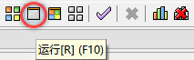

# 《数据结构》课本源码与习题解析

## 源码语言

> **C语言** [兼容到[C89/C90](https://baike.baidu.com/item/c89/22224985?fr=aladdin)]    

## 测试环境

> **Dev-C++** [5.11]    
> **TDM-GCC** [gcc-4.9.2]    

## 使用说明

1. 确保 **Dev-C++** 已安装完毕（安装方式可自行搜索），并选择"TDM-GCC 4.9.2 64-bit Debug"编译选项（别的编译选项也可使用）    

2. 启动Dev-C++，选择"打开项目"（也可从"文件"菜单中打开）    

3. 选择目标项目文件*.dev，打开项目    

4. 配置"include"目录，使用Status文件夹所在的目录，主要为引入 **Status.h** 文件做准备    
    
    

注：因为新建项目时，默认选择的是C项目(尽管后缀使用了.cpp)，因此这里要设置"**C包含的文件**"。如果新建项目中选择了C++项目，则需要为"**C++包含的文件**"也设置`Status`源码目录。    

5. 配置静态库位置（全局），即 **Status.a** 静态库所在的目录    
    

6. 对项目进行"编译"后，选择包含"main"方法的源码"运行"即可，常用的命令如下图    
    
    

## 注意事项

1. 教材源码CourseBook跟习题集源码ExerciseBook是放在**多个项目**当中的    
2. Dev-C++版本的源码，其文件编码格式使用了GB2312    
3. 由于C语言源码在Dev-C++中存在一些兼容问题（行注释的兼容问题），所以涉及 **.c** 后缀的文件均改成了 **.cpp** 的后缀形式    
4. **Dev-C++也可以用于打开"CFree"版本的源码，所以如果使用CFree遇到兼容性问题，可尝试使用Dev-C++**    
5. 上述配置的静态库是全局生效的，也可以对单个项目进行局部配置，配置方式如图：    
    
    
