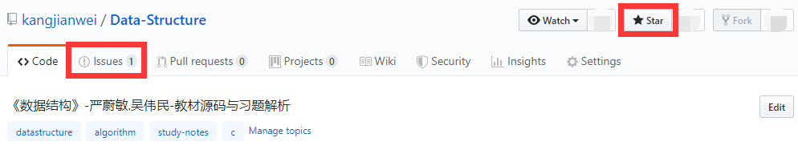

# 《数据结构》课本源码与习题解析


## 项目介绍

本项目中的源码与教材《**数据结构-C语言版**》[严蔚敏,吴伟民版]以及《**数据结构题集-C语言版**》[严蔚敏,吴伟民,米宁版]配套。

|           数据结构教材           |           数据结构题集           |
| :----------------------------: | :----------------------------: |
|  |  |


## 项目结构

本项目包含了**教材源码**跟**习题源码**，并分为4个版本，分别是：**CFree**、**Dev-C++**、**CLion**、**VisualC++**，其中：    

- **CFree** 版本是**早期**上传的完整版本，该版本在CFree这个IDE下测试通过。**此版本虽有瑕疵，但不会再实时维护**，因为新的更新会在下面三个分支版本中呈现。    
- **Dev-C++** 版本是指在Dev-C++这个IDE下测试通过的版本。    
- **CLion** 版本是指在CLion这个IDE下测试通过的版本。    
- **VisualC++** 版本是指在Microsoft Visual C++ 2010这个IDE下测试通过的版本。    

> IDE的选择    
>> CFree是一个优秀的国产软件，麻雀虽小五脏俱全，非常适合新手使用。不过该产品早已停更，在win10上有些兼容问题，需要调教。    
>    
>> Dev-C++是一个开源软件，同CFree一样小巧实用。最关键的是，可以兼容win10，推荐使用。    
>    
>> CLion需要掌握一点cmake知识，对笔记本性能要求也略高。不过JetBrains系列的产品，功能优秀没得说，强烈建议尝试。    
>    
>> Microsoft Visual C++是微软出品，该系列号称地表最强，不过复杂度也是很高，对于新手并不友好，需要耐心琢磨。如果将来不是走C/C++/C#等路线，可以先不使用。（注：从2018年开始，计算机二级C语言项目的考试中，已将VC++6换成了Microsoft Visual C++ 2010。所以如果有考级需求的同学，请自行熟悉该IDE）    

**习题解析**中存储了《数据结构题集》中非代码题的解析，对于需要写代码解决的问题，参见 **Dev-C++**、**CLion**、**VisualC++** 这三个版本中的源码。    

```
注：
1. "CFree"是完整版本。"Dev-C++"/"CLion"/"VisualC++"是新增的版本，这三个版本最终会取代"CFree"版本。    
2. "CFree"版本既可以用CFree直接打开，也支持用Dev-C++打开，所以当使用CFree遇到兼容问题时，可尝试用Dev-C++。    
3. 上述四个版的代码是同步更新的，但是各版本之间相互独立，没有任何依赖关系，允许单独运行/测试。    
4. 对所有版本的代码均未充分测试，尤其是很多代码没有完成的边界检查(原因是此处以实现算法正确性为目的，而较少考虑程序的健壮性)，所以如有BUG请到Issues反馈。    
```


## 更新目标

总的目标是保障正确性，提高可读性，降低学习难度，具体来说包含以下几点：    

1. ★★★项目工程化。    
2. 修复一些已知/潜在的BUG。    
3. 简化源码之间的引用关系，争取每个模块都可以单独运行测试。    
4. 修剪被引用源码中的次要内容，使得焦点更聚集，重点更突出。    
5. 增加注释与帮助信息，使源码展示更友好。    
6. 出自教材中的算法，会尽量使其代码与教材一致，如有改动，会在注释中提示。其它算法会视情形书写，不唯一。    
7. 修改部分被引入的结构，这一点需要视不同题目的要求而定；大多数被引入的结构会原封不动地保留下来。

## 使用方式

*   开箱即用    

> 将源码克隆/下载到本地后，可以查看各分支内的 **README** 文件以获取帮助信息    

## 注意事项

1. **本内容仅限个人学习使用，未经作者许可，不得用于商业用途**    
2. **源码仅供参考，别抄作业**    
3. **欢迎Star项目，并鼓励在Github提交[Issues](https://github.com/kangjianwei/Data-Structure/issues)来反馈问题，在博客上发私信未必可以及时看到**    



## Commit图例

| 序号 |   emoji   |               在本项目中的含义               |   简写标记   |
| ---- | --------- | ------------------------------------------- | ----------- |
| (0) | :tada:    | 初始化项目                                   | `:tada:`    |
| (1) | :memo:    | 更新文档，包括但不限于README                  | `:memo:`    |
| (2) | :bulb:    | 发布新的源码                                 | `:bulb:`    |
| (3) | :recycle: | 重构，主要指修改已有的源码与注释               | `:recycle:` |
| (4) | :pencil2: | 校对，主要指更正错别字、修改源码排版、更新注释等 | `:pencil2:` |
| (5) | :bug:     | 修复代码中的BUG                              | `:bug:`     |


## 相关链接

[个人博客](http://www.cnblogs.com/kangjianwei101)     


## 脚注

Commit信息中的`emoji`参考来源：    

* [Full Emoji List](https://unicode.org/emoji/charts/full-emoji-list.html)   
* [gitmoji](https://gitmoji.carloscuesta.me/)    


## 附：教材源码目录

| 章             | 节                          | 内容                                | 包含算法                          | 备注                         |
| :------------- | :-------------------------- | :--------------------------------- | :------------------------------- | :-------------------------- |
| 01 绪论        | Status                      |                                    |                                  | 定义一些共享常量和函数        |
| 02 线性表      | SqList                      | 顺序表                             | 2.3、2.4、2.5、2.6                | 线性表的顺序存储结构          |
|                | Union                       | A=A∪B                              | 2.1                              |                             |
|                | MergeSqList                 | C=A+B                              | 2.2、2.7                         | 归并顺序表                   |
|                | LinkList                    | 链表                                | 2.8、2.9、2.10、2.11              | 线性表的链式存储结构          |
|                | MergeList                   | C=A+B                              | 2.12                             | 归并链表                     |
|                | SLinkList                   | 静态链表                            | 2.13、2.14、2.15、2.16            |                             |
|                | Difference                  | (A-B)∪(B-A)                        | 2.17                             |                             |
|                | DuLinkList                  | 双向循环链表                        | 2.18、2.19                       |                             |
|                | ELinkList                   | 扩展的线性链表                      | 2.20                             |                             |
|                | MergeEList                  | C=A+B                              | 2.21                             | 归并扩展的线性链表            |
|                | Polynomial                  | 一元多项式                          | 2.22、2.23                       |                             |
| 03 栈和队列     | SqStack                     | 栈                                  |                                  | 顺序存储结构                 |
|                | Conversion                  | 进制转换                            | 3.1                              | 栈的应用                     |
|                | LineEdit                    | 行编辑程序                          | 3.2                              | 栈的应用                     |
|                | Maze                        | 迷宫寻路                            | 3.3                              | 栈的应用                     |
|                | Expression                  | 表达式求值                          | 3.4                              | 栈的应用                     |
|                | Hanoi                       | 汉诺塔                             | 3.5                              | 递归                         |
|                | LinkQueue                   | 链列                                |                                  | 链式存储结构                 |
|                | SqQueue                     | 顺序队列                            |                                  | 循环队列，顺序存储结构        |
|                | BankQueuing                 | 模拟银行排队                        | 3.6、3.7                         | 队列的应用                   |
| 04 串          | SString                     | 顺序串                             | 4.1、4.2、4.3、4.5                | 顺序存储                     |
|                | HString                     | 堆串                                | 4.4                              | 顺序存储，动态分配内存        |
|                | LString                     | 块链串                             |                                  | 顺序存储+链式存储             |
|                | KMP                         | KMP算法                             | 4.6、4.7、4.8                    | 字符串匹配算法               |
|                | WordList                    | 关键词索引                          | 4.9、4.10、4.11、4.12、4.13、4.14 | 堆串和线性表的应用            |
| 05 数组和广义表 | Array                       | 多维数组                            |                                  |                             |
|                | TSMatrix                    | 稀疏矩阵                            | 5.1、5.2                         | 三元组顺序表存储方式          |
|                | RLSMatrix                   | 稀疏矩阵                            | 5.3                              | 行逻辑链接的顺序表存储方式     |
|                | CrossList                   | 稀疏矩阵                            | 5.4                              | 十字链表存储方式              |
|                | GList-HT                    | 广义表                             | 5.5、5.6、5.7、5.8                | 头尾链表存储表示              |
|                | GList-E                     | 广义表                             |                                  | 扩展线性链表存储表示          |
|                | MPList                      | m元多项式                           |                                  | 链式存储                     |
| 06 树和二叉树   | SqBiTree                    | 二叉树顺序存储结构                  |                                  |                             |
|                | BiTree                      | 二叉树的二叉链表存储结构             | 6.1、6.2、6.3、6.4                |                             |
|                | BiTriTree                   | 二叉树的三叉链表存储结构             |                                  |                             |
|                | BiThrTree                   | 线索二叉树                          | 6.5、6.6、6.7                    |                             |
|                | PTree                       | 树的双亲表存储表示                  |                                  |                             |
|                | CTree                       | 树的孩子链表(带双亲)的存储表示       |                                  |                             |
|                | CSTree                      | 树的二叉链表（孩子-兄弟）结构存储表示 |                                  |                             |
|                | MFSet                       | 集合                                | 6.8、6.9、6.10、6.11              |                             |
|                | HuffmanTree                 | 赫夫曼树                            | 6.12、6.13                       | 又称"哈夫曼树"               |
|                | PowerSet                    | 冪集                                | 6.14/6.15                        |                             |
|                | NQueens                     | N皇后问题                           | 6.16                             |                             |
| 07 图          | MGraph                      | 图的邻接矩阵存储                    | 7.1、7.2、7.4、7.5、7.6           | 有向图、有向网、无向图、无向网 |
|                | ALGraph                     | 图的邻接表存储                      |                                  | 有向图、有向网、无向图、无向网 |
|                | OLGraph                     | 图的十字链表存储                    | 7.3                              | 有向图、有向网、无向图、无向网 |
|                | AMLGraph                    | 图的邻接多重表存储                  |                                  | 无向图、无向网               |
|                | SpanningTree                | 无向图的生成树                      | 7.7、7.8                         | 深度优先生成树               |
|                | StronglyConnectedComponents | 有向图强连通分量                    |                                  | Kosaraju算法和Tarjan算法     |
|                | MinimumSpanningTree         | 无向网的最小生成树                  | 7.9                              | Prim算法和Kruskal算法        |
|                | ArticulationPoints          | 无向图的关节点                      | 7.10、7.11                       |                             |
|                | TopologicalSorting          | AOV-网的拓扑排序                    | 7.12                             | 有向图                       |
|                | CriticalPathMethod          | AOE-网的关键路径                    | 7.13、7.14                       | 有向网                       |
|                | ShortestPaths               | 最短路径算法                        | 7.15、7.16                       | Dijkstra算法和Floyd算法      |
| 08 动态存储管理 | BoundaryTagMethod           | 边界标识法                          | 8.1                              |                              |
|                | BuddySystem                 | 伙伴系统                            | 8.2                              |                              |
|                | GarbageCollection           | 无用单元收集                        | 8.3                              | 无栈遍历广义表                |
