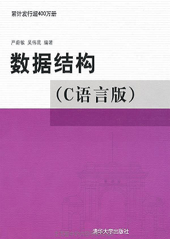

# 《数据结构》课本源码与习题解析


## 项目介绍

本项目中的源码与教材《**数据结构-C语言版**》[严蔚敏,吴伟民版]以及《**数据结构题集-C语言版**》[严蔚敏,吴伟民,米宁版]配套。

|           数据结构教材           |           数据结构题集           |
| :----------------------------: | :----------------------------: |
|  |  |


## 项目结构

本项目包含了**教材源码**跟**习题源码**，并分为4个版本，分别是：**CFree**、**Dev-C++**、**CLion**、**VisualC++**，其中：

- **CFree** 版本是早期上传的完整版本，该版本在CFree这个IDE下测试通过。此版本中的代码虽有瑕疵，但不会再维护，新的更新会在下面三个分支版本中呈现。
- **Dev-C++** 版本是指在Dev-C++这个IDE下测试通过的版本。
- **CLion** 版本是指在CLion这个IDE下测试通过的版本。
- **VisualC++** 版本是指在Microsoft Visual C++ 2010这个IDE下测试通过的版本。

> IDE的选择    
>> CFree是一个优秀的国产软件，麻雀虽小五脏俱全，非常适合新手使用。不过该产品早已停更，在win10上有些兼容问题，需要调教。    
>  
>> Dev-C++是一个开源软件，同CFree一样小巧实用。最关键的是，可以兼容win10，推荐使用。   
>  
>> CLion需要掌握一点cmake知识，对笔记本性能要求也略高。不过JetBrains系列的产品，功能优秀没得说，强烈建议尝试。    
>  
>> Microsoft Visual C++是微软出品，该系列号称地表最强，不过复杂度也是很高，对于新手并不友好，需要耐心琢磨。如果将来不是走C/C++/C#等路线，可以先不使用。（注：从2018年开始，计算机二级C语言项目的考试中，已将VC++6换成了Microsoft Visual C++ 2010。所以如果有考级需求的同学，请自行熟悉该IDE）    

**习题解析**中存储了《数据结构题集》中非代码题的解析，对于需要写代码解决的问题，参见 **Dev-C++**、**CLion**、**VisualC++** 这三个版本中的源码。

```
注：
1. "CFree"是完整版本。"Dev-C++"/"CLion"/"VisualC++"是新增的版本，这三个版本最终会取代"CFree"版本。
2. "CFree"版本既可以用CFree直接打开，也支持用Dev-C++打开，所以当使用CFree遇到兼容问题时，可尝试用Dev-C++。
3. 上述四个版本各自独立，没有任何依赖关系，可单独运行/测试。
4. 对所有版本的代码均未充分测试，所以如有BUG请到Issues反馈。
```


## 更新目标

总的目标是保障正确性，提高可读性，降低学习难度，具体来说包含以下几点：

1. 项目工程化★★
2. 修复一些已知/潜在的BUG
3. 简化源码之间的引用关系，争取每个模块都可以单独运行测试
4. 修剪被引用源码中的次要内容，使得焦点更聚集，重点更突出
5. 增加注释与帮助信息，使源码展示更友好
6. 出自教材中的算法，会尽量使其代码与教材一致，如有改动，会在注释中提示。其它算法会视情形书写，不唯一


## 使用方式

*   开箱即用

> 将源码克隆/下载到本地后，可以查看各分支内的README.md文件以获取帮助信息


## 注意事项

1. **本内容仅限个人学习使用，未经作者许可，不得用于商业用途**
2. **源码仅供参考，别抄作业**
3. **鼓励在Github提交[Issues](https://github.com/kangjianwei/Data-Structure/issues)来反馈，在博客上发私信未必可以及时看到**


## Commit图例

| 序号 |   emoji   |               在本项目中的含义               |   简写标记   |
| ---- | --------- | ------------------------------------------- | ----------- |
| (0) | :tada:    | 初始化项目                                   | `:tada:`    |
| (1) | :memo:    | 更新文档，包括但不限于README                  | `:memo:`    |
| (2) | :bulb:    | 发布新的源码                                 | `:bulb:`    |
| (3) | :recycle: | 重构，主要指修改已有的源码与注释               | `:recycle:` |
| (4) | :pencil2: | 校对，主要指更正错别字、修改源码排版、更新注释等 | `:pencil2:` |
| (5) | :bug:     | 修复代码中的BUG                              | `:bug:`     |


## 相关链接

[个人博客](http://www.cnblogs.com/kangjianwei101) 


## 脚注
    
Commit信息中的`emoji`参考来源：
    
* [Full Emoji List](https://unicode.org/emoji/charts/full-emoji-list.html)   
   
* [gitmoji](https://gitmoji.carloscuesta.me/) 


## 附：教材源码目录

| 章        | 节          | 内容          | 包含算法               | 备注                 |
| :------- | :---------- | :----------- | :-------------------- | :------------------- |
| 01 绪论   |             |              |                       | 定义一些共享常量和函数 |
| 02 线性表 | SqList      | 顺序表        | 2.3、2.4、2.5、2.6     |                      |
|          | Union       | A=A∪B        | 2.1                   |                      |
|          | MergeSqList | C=A+B        | 2.2、2.7               | 归并顺序表            |
|          | LinkList    | 链表          | 2.8、2.9、2.10、2.11   |                      |
|          | MergeList   | C=A+B        | 2.12                  | 归并链表             |
|          | SLinkList   | 静态链表      | 2.13、2.14、2.15、2.16 |                      |
|          | Difference  | (A-B)∪(B-A)  | 2.17                  |                      |
|          | DuLinkList  | 双向循环链表   | 2.18、2.19             |                      |
|          | ELinkList   | 扩展的线性链表 | 2.20                  |                      |
|          | MergeEList  | C=A+B        | 2.21                  | 归并扩展的线性链表     |
|          | Polynomial  | 一元多项式     | 2.22、2.23             |                      |
