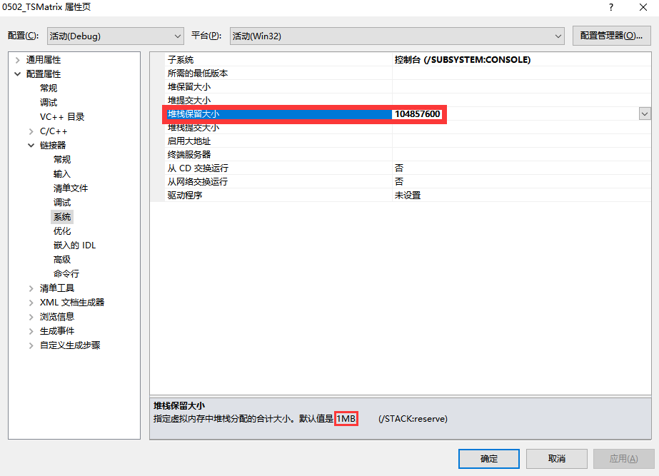

# 注意事项

该项目在微软系列的IDE中运行时，可能会由于栈溢出而无法正常执行。

以Visual C++ 2010为例，其栈内存默认为`1M`。但是本程序申请的栈内存超过了`1M`，因而会导致内存溢出。

解决方案有三个（生产中推荐方案三）：

1. 减小申请的栈内存，如下图，将原来的`12500`改为`100`：

2. 增加IDE允许的栈内存，如下图，打开当前项目的属性页，将栈内存从默认的`1M`改为`100M`（注：`100 M` = `104857600 B`）：

3. 将三元组存储结构改为`堆存储`形式，如下图。但是，这样修改之后，后续的稀疏矩阵创建函数也要作出相应的修改，读者可以尝试：

