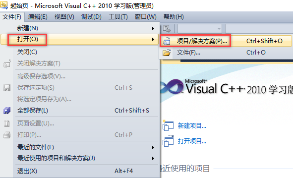
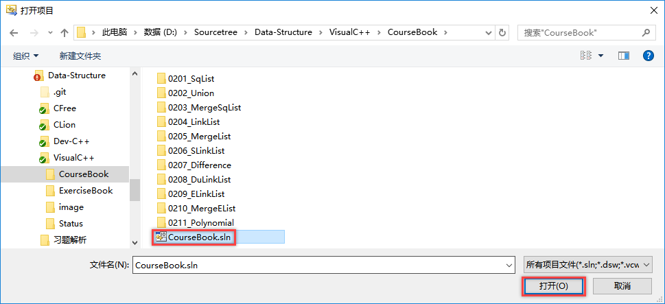
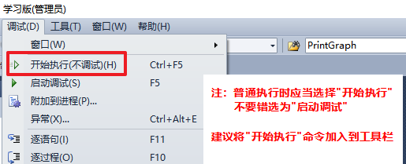
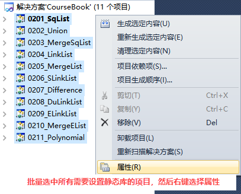
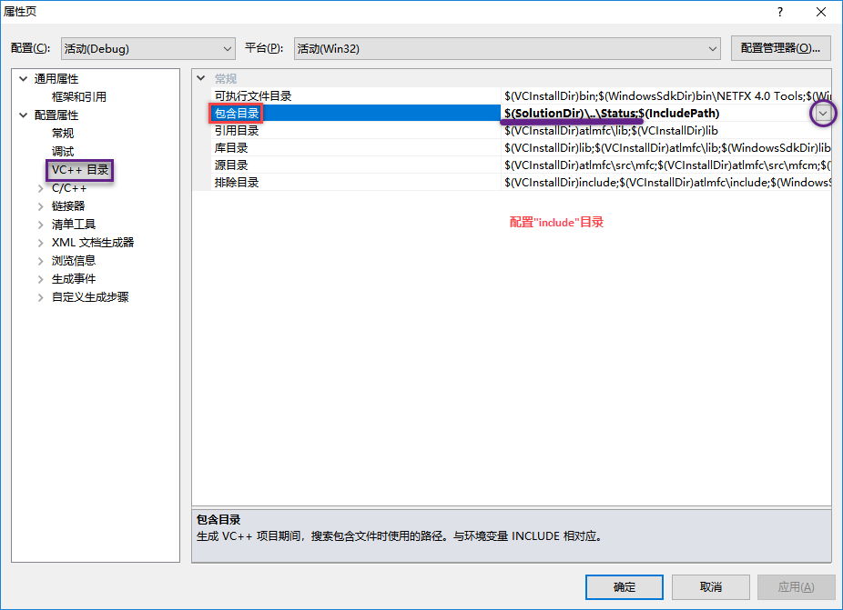
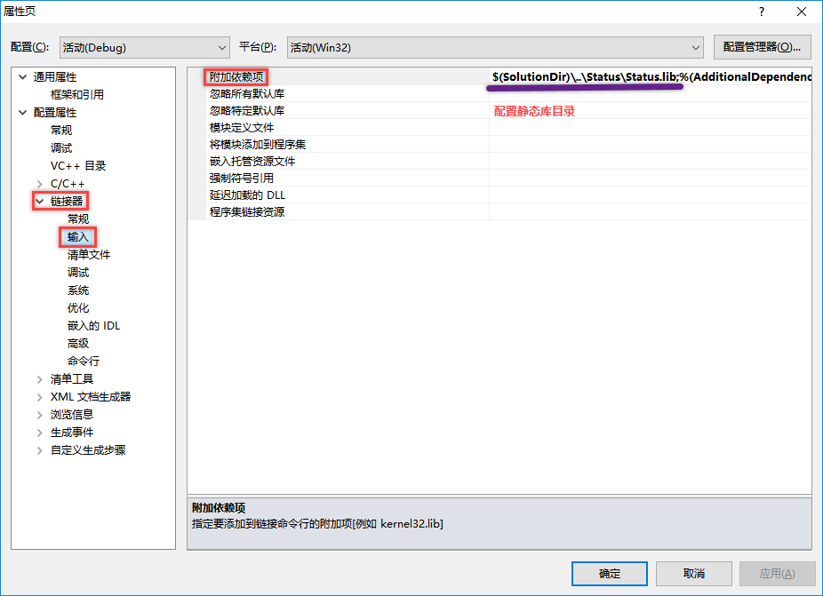
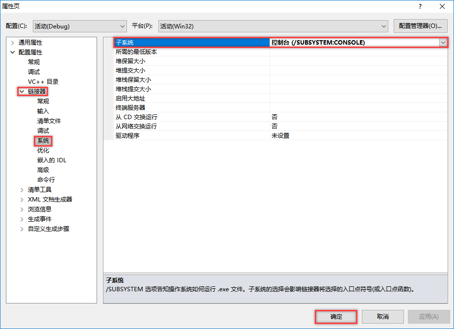

# 《数据结构》课本源码与习题解析

## 源码语言

> **C语言** [兼容到[C89/C90](https://baike.baidu.com/item/c89/22224985?fr=aladdin)]    

## 测试环境

> **Microsoft Visual C++** [2010]    
> **MSVC++** [10.0]    

## 使用说明

1. 确保 **Microsoft Visual C++ 2010** 已安装完毕（也可使用更高版本的Visual系列的软件）    

2. 启动Microsoft Visual C++ 2010，选择"打开项目"    

3. 选择目标项目，并启动它    

4. 选择要测试项目运行即可    

## 注意事项

1. 教材源码CourseBook跟习题集源码ExerciseBook是放在**两个项目**当中的    
2. VisualC++版本的源码，其文件编码格式使用了GB2312    
3. 新版本的Microsoft Visual已经支持gcc编译环境，即使用类似CLion中的CMakeLists.txt文件指定编译规则，配置方式请自行搜索    
4. Microsoft Visual C++ 2010中静态库的配置方式如下图：    
    
    
    
5. 让输出显示在控制台上    
    
