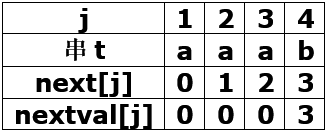
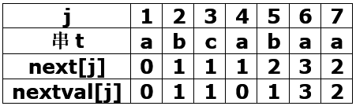
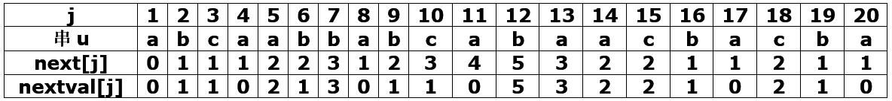
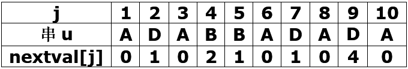
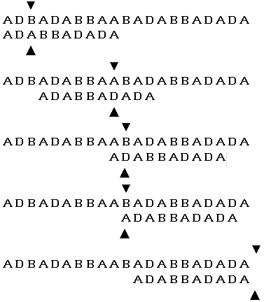
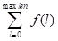
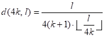

# 第4章 串

## 一、基础知识题

### 4.1 简述空串和空格串（或称空格符串）的区别。

> 一个空字符为：'\0' ，一个空格字符为：' ' 。空串是只包含一个空字符的字符串，其长度为0。    
> 空格串是除了在结尾包含空字符外，还包含若干空格字符的字符串，统计其长度时，要将除空字符外的字符个数都计算在内。    

### 4.2 对于教科书4.1节中所述串的各个基本操作，讨论是否可由其他基本操作构造而得，如何构造？

> 对于串操作中的最小操作子集，即串赋值（StrAssign）、串比较（StrCompare）、求串长（StrLength）、串联接（Conact）以及求子串（SubString）5种操作不可由其他操作来实现。    
> 其他串操作则可利用串的最小操作子集实现。    

### 4.3 设s = 'I AM A STUDENT'，t = 'GOOD'，q = 'WORKER'。
##### 求：StrLength(s)，StrLength(t)，SubString(s, 8, 7)，SubString(t, 2, 1)，Index(s, 'A')，Index(s, t)，Replace(s, 'STUDENT', q)，Concat(SubString(s, 6, 2), Concat(t, SubString(s, 7, 8)))。

> StrLength(s) = 14;    
> StrLength(t) = 4;    
> SubString(s, 8, 7) = 'STUDENT';    
> SubString(t, 2, 1) = 'O';    
> Index(s, 'A') = 3;    
> Index(s, t) = 0;    
> Replace(s, 'STUDENT', q) = 'I AM A WORKER';    
> Concat(SubString(s, 6, 2), Concat(t, SubString(s, 7, 8))) = 'A GOOD STDENT'.    

### 4.4 已知下列字符串
###### a = 'THIS',　f = 'A SAMPLE',　c = 'GOOD',　d = 'NE',　b = ''.
###### s = Concat(a, Concat(SubString(f, 2, 7), Concat(b, SubString(a, 3, 2)))),
###### t = Replace(f, SubString(f, 3, 6), c),
###### u = Concat(SubString(c, 3, 1), d),
###### g = 'IS',
###### v = Concat(s, Concat(b, Concat(t, Concat(b, u)))),
###### 试问：s，t，v，StrLength(s)，Index(v, g)，Index(u, g)各是什么？

> s = 'THIS SAMOLE IS';    
> t = 'A GOOD';    
> v = 'THIS SAMPLE IS A GOOD ONE';    
> StrLength(s) = 14;    
> Index(v, g) = 3;    
> Index(u, g) = 0.    

### 4.5 试问执行以下函数会产生怎样的输出结果？

```c
void demonstrate()
{
  StrAssign(s, 'THIS IS A BOOK');
  Replace(s, SubString(s, 3, 7), 'ESE ARE');
  StrAssign(t, Concat(s, 'S'));
  StrAssign(u, 'XYXYXYXYXYXY');
  StrAssign(v, SubString(u, 6, 3));
  StrAssign(w, 'W');
  printf('t=', t, 'v=', v, 'u=', Replace(u, v, w));
}//demonstrate
```

> t='THESE ARE BOOKS', v='YXY', u='XWXWXW'

### 4.6 已知：s = '(XYZ)+\*', t = '(X+Z)\*Y'。试利用联接、求子串和置换等基本运算，将s转化为t。

> S1 = SubString(s, 3, 1);  //S1 = 'Y'    
> S2 = SubString(s, 6, 1);  //S2 = '+'    
> Replace(s, S1, S2);  //s = '(X+Z)+\*'    
> Concat(S3, s, S1);  //S3 = '(X+Z)+\*Y'    
> Concat(t, SubString(S3, 1, 5), SubString(S3, 7, 2));    

### 4.7 令s = 'aaab',t = 'abcabaa',u = 'abcaabbabcabaacbacba'。试分别求出它们的next函数值和nextval函数值。

> **s**



> **t**



> **u**



### 4.8 已知主串s = 'ADBADABBAABADABBADADA'，模式串pat = 'ADABBADADA'，写出模式串的nextval函数值，并由此画出KMP算法匹配的全过程。





### 4.9 在以链表存储串值时，存储密度是结点大小和串长的函数。假设每个字符占一个字节，每个指针占4个字节，每个结点的大小为4的整数倍，已知串长的分布函数为f(l)且，求结点大小为4k，串长为l时的存储密度d(4k, l)（用公式表示）。



## 二、算法设计题

```c
在编写4.10至4.14题的算法时，请采用StringType数据类型：
StringType是串的一个抽象数据类型，它包含以下五种基本操作：

void StrAssign (StringType &t, StringType s)
//将s的值赋给t。s的实际参数可以是串变量或者串常量（如：‘abcd’）

int StrCompare (StringType s, StringType t)
//比较s和t。若s>t，返回值>0；若s=t，返回值=0；若s<t，返回值<0

int StrLength (StringType s)
//返回s中的元素个数，即该串的长度

StringType Concat (StringType s, StringType t)
//返回由s和t联接而成的新串

StringType SubString (StringType s, int start, int len)
// 当1≤start≤StrLength(s)且0≤len≤StrLength(s)-start+1时，
// 返回s中第start个字符起长度为len的子串，否则返回空串
```

### 4.10 编写对串求逆的递推算法。

----------

### 4.11 编写算法，求得所有包含在串s中而不包含在串t中的字符（s中重复的字符只选一个）构成的新串r，以及r中每个字符在s中第一次出现的位置。

----------

### 4.12 编写一个实现串的置换操作Replace(&S, T, V)的算法。

----------

### 4.13 编写算法，从串s中删除所有和串t相同的子串。

----------

### 4.14 利用串的基本操作以及栈和集合的基本操作，编写“由一个算术表达式的前缀式求后缀式”的递推算法（假设前缀式不含语法错误）。

----------

> ###### 在编写4.15至4.20题的算法时，请采用教科书4.2.1节中所定义的定长顺序存储表示，而不允许调用串的基本操作。

### 4.15 编写算法，实现串的基本操作StrAssign(&T, chars)。
### 4.16 编写算法，实现串的基本操作StrCompare(S, T)。
### 4.17 编写算法，实现串的基本操作Replace(&S, T, V)。

----------

### 4.18 编写算法，求串s所含不同字符的总数和每种字符的个数。

----------

### 4.19 在串的定长顺序存储结构上直接实现4.11题要求的算法。

----------

### 4.20 编写算法，从串s中删除所有和串t相同的子串。

----------

### 4.21 假设以结点大小为1（且附设头结点）的链表结构表示串。试编写实现下列六种串的基本操作StrAssign，StrCopy，StrCompare，StrLength，Concat和SubString的函数。

----------

### 4.22 假设以块链结构表示串。试编写将串s插入到串t中某个字符之后的算法（若串t中不存在此字符，则将串s联接在串t的末尾）。

----------

### 4.23 假设以块链结构作串的存储结构。试编写判别给定串是否具有对称性的算法，并要求算法的时间复杂度为O(StrLength(S))。

----------

> ###### 在编写4.24至4.26题的算法时，请采用教科书4.2.2节中所定义的堆分配存储表示。

### 4.24 试写一算法，在串的堆存储结构上实现串基本操作Concat(&T, s1，s2)。
### 4.25 试写一算法，实现堆存储结构的串的置换操作Replace(&S, T, V)。
### 4.26 试写一算法，实现堆存储结构的串的插入操作 StrInsert(&S, pos, T)。

----------

### 4.27 当以教科书4.2.1节中定义的定长顺序结构表示串时，可如下所述改进定位函数的算法：先将模式串t中的第一个字符和最后一个字符与主串s中相应的字符比较，在两次比较都相等之后，再依次从t的第二个字符逐个比较。这样做可以克服算法Index（算法4.5）在求模式串'a<sup>k</sup>b'(a<sup>k</sup>表示连续k个字符'a') 在主串'a<sup>n</sup>b'（k≤n）中的定位函数时产生的弊病。试编写上述改进算法，并比较这两种算法在作Index('a<sup>n</sup>b','a<sup>k</sup>b')运算时所需进行的字符间的比较次数。

----------

### 4.28 假设以结点大小为1（带头结点）的链表结构表示串，则在利用next函数值进行串匹配时，在每个结点中需设三个域：数据域chdata、指针域succ和指针域next。其中chdata域存放一个字符；succ域存放指向同一链表中后继结点的指针；next域在主串中存放指向同一链表中前驱结点的指针；在模式串中，存放指向当该结点的字符与主串中的字符不等时，在模式串中下一个应进行比较的字符结点（即与该字符的next函数值相对应的字符结点）的指针，若该节点字符的next函数值为0，则其next域的值应指向头结点。试按上述定义的结构改写求模式串的next函数值的算法。
### 4.29 试按4.28题定义的结构改写串匹配的改进算法（KMP算法）。

----------

### 4.30 假设以定长顺序存储结构表示串，试设计一个算法，求串s中出现的第一个最长重复子串及其（第一次出现的）位置，并分析你的算法的时间复杂度。

----------

### 4.31 假设以定长顺序存储结构表示串，试设计一个算法，求串s和串t的一个最长公共子串，并分析你的时间复杂度。若要求第一个出现的最长公共子串（即它在串s和串t的最左边的位置上出现）和所有的最长公共子串，讨论你的算法能否实现。

----------
