# 第5章 数组与广义表

## 一、基础知识题

### 5.1 假设有二维数组A6×8，每个元素用相邻的6个字节存储，存储器按字节编址，已知A的起始存储位置（基地址）为1000，计算：
###### (1) 数组A的体积（即存储量）；
###### (2) 数组A的最后一个元素a57的第一个字节的地址；
###### (3) 按行存储时，元素a14的第一个字节的地址；
###### (4) 按列存储时，元素a47的第一个字节的地址。

> (1)V = 6×8×6 = 288 Byte    
> (2)Loc(5,7) = 1000+(6×8-1)×6 = 1282    
> (3)Loc(1,4)(行) = 1000+(1×8+4)×6 = 1072    
> (4)Loc(4,7)(列) = 1000+(6×7+4)×6 = 1276    

### 5.2 假设按低下标优先存储整数数组A9×3×5×8时，第一个元素的字节地址是100，每个整数占四个字节。问下列元素的存储地址是什么？
###### (1) a0000
###### (2) a1111
###### (3) a3125
###### (4) a8247

> (1)Loc(0,0,0,0) = 100      
> (2)Loc(1,1,1,1) = 100+(1×3×5×8+1×5×8+1×8+1)×4 = 776      
> (3)Loc(3,1,2,5) = 100+(3×3×5×8+1×5×8+2×8+5)×4 = 1784     
> (4)Loc(8,2,4,7) = 100+(8×3×5×8+2×5×8+4×8+7)×4 = 4416     

### 5.3 按高下标优先存储方式（以最右的下标为主序），顺序列出数组A2×2×3×3中所有元素aijkl，为了简化表达，可以只列出（i，j，k，l）的序列。

> (0,0,0,0) (1,0,0,0) (0,1,0,0) (1,1,0,0)     
> (0,0,1,0) (1,0,1,0) (0,1,1,0) (1,1,1,0)     
> (0,0,2,0) (1,0,2,0) (0,1,2,0) (1,1,2,0)     
>      
> (0,0,0,1) (1,0,0,1) (0,1,0,1) (1,1,0,1)     
> (0,0,1,1) (1,0,1,1) (0,1,1,1) (1,1,1,1)     
> (0,0,2,1) (1,0,2,1) (0,1,2,1) (1,1,2,1)     
>      
> (0,0,0,2) (1,0,0,2) (0,1,0,2) (1,1,0,2)     
> (0,0,1,2) (1,0,1,2) (0,1,1,2) (1,1,1,2)     
> (0,0,2,2) (1,0,2,2) (0,1,2,2) (1,1,2,2)     
>    
> 思路：     
>     
> 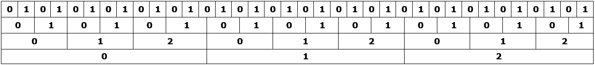    

### 5.4 将教科书5.3.1节中的式（5-3）改写为一个等式的形式。

> 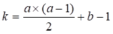 ，其中a=Max{i,j}，b=Min{i,j}。     

### 5.5 设有上三角矩阵(aij)n×n，将其上三角元素逐行存于数组B[m]中（m充分大），使得B[k]=aij，且k=f1(i)+f2(j)+c。试推导出函数f1，f2和常数c（要求f1和f2中不含常数项）。

> 根据题意得：     
> 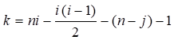(1≤i≤j≤n，k≥0)      
> 故：      
> 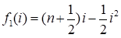，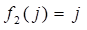，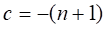      

### 5.6 设有三对角矩阵(aij)n×n，将其三条对角线上的元素存于数组B[3][n]中，使得元素B[u][v]=aij，试推导出从（i，j）到（u，v）的下标变换公式。

> 行：u = i – j + 1。      
> 列：v = j - 1。      
> 图示：      
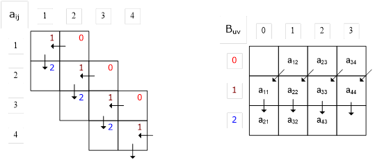    

### 5.7 设有三对角矩阵(aij)n×n，将其三条对角线上的元素逐行地存于数组B[3n-2]中，使得B[k]=aij，求：
##### (1) 用i，j表示k的下标变换公式；
##### (2) 用k表示i，j的下标变换公式。

> (1)      
>      
> 逐行累加考虑：(|i-j|≤1)      
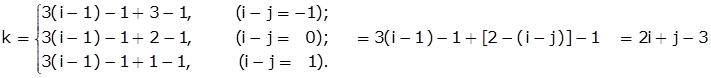
>      
> 用“补缺法”考虑：(|i-j|≤1)      
> 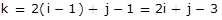
>      
> (2) i = (k+1)/3 + 1,  (0≤k≤3n-1); j = k+3-2i = k+1-2[(k+1)/3].    

### 5.8 假设一个准对角矩阵

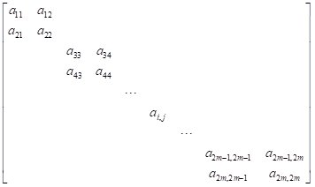

##### 按以下方式存于一维数组B[4m]中：
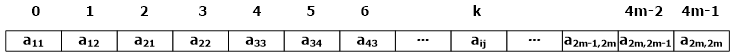

##### 写出由一对下标（i，j）求k的转换公式。

> k = 2i - j%2 - 1.      
>      
> **思路：**      
>
>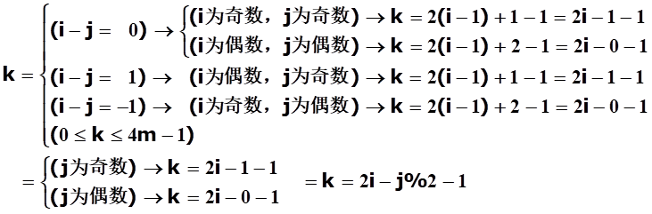

### 5.9 已知A为稀疏矩阵，试从空间和时间角度比较采用两种不同的存储结构（二维数组和三元组表）完成求运算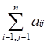的优缺点。

> (1)空间与时间复杂度分析：      
>     
> 用二维数组存储时，空间与时间复杂度均为O(n×n)；设非零元个数为t，则用三元组存储时，空间与时间复杂度为O(t)。      
>     
> (2)优缺点分析：      
>     
> 当非零元个数t<<n×n时，用二维数组存储矩阵对空间和时间的开支都是很大的，而用三元组存储矩阵则可节省不少空间和操作时间。但是当t与n2等数量级时，O(t)与O(n×n)几乎相等，此时三元组的优势就不明显了，反倒是用二维数组存储矩阵更简明直观。      

### 5.10 求下列广义表操作的结果：
###### (1) GetHead【(p, h, w)】;
###### (2) GetTail【(b, k, p, h)】;
###### (3) GetHead【((a, b), (c, d))】;
###### (4) GetTail【((a, b), (c, d))】;
###### (5) GetHead【GetTail【((a, b), (c, d))】】;
###### (6) GetTail【GetHead【((a, b), (c, d))】】;
###### (7) GetHead【GetTail【GetHead【((a, b), (c, d))】】】;
###### (8) GetTail【GetHead【GetTail【((a, b), (c, d))】】】.
###### 注意：【】是函数的符号。

> (1) = p     
> (2) = (k, p, h)     
> (3) = (a, b)     
> (4) = ((c, d))     
> (5) = GetHead【((c, d))】=(c, d)    
> (6) = GetTail【(a, b)】=(b)     
> (7) = GetHead【GetTail【(a, b)】】=GetHead【(b)】=b    
> (8) = GetTail【GetHead【((c, d))】】=GetTail【(c, d)】=(d)     

### 5.11 利用广义表的GetHead和GetTail操作写出如上题的函数表达式，把原子banana分别从下列广义表中分离出来。
###### (1) L1 = (apple, pear, banana, orange);
###### (2) L2 = ((apple, pear), (banana, orange));
###### (3) L3 = (((apple), (pear), (banana), (orange)));
###### (4) L4 = (apple, (pear), ((banana)), (((orange))));
###### (5) L5 = ((((apple))), ((pear)), (banana), orange);
###### (6) L6 = ((((apple), pear), banana), orange); 
###### (7) L7 = (apple, (pear, (banana), orange));

> (1) GetHead【GetTail【GetTail【L1】】】      
> (2) GetHead【GetHead【GetTail【L2】】】      
> (3) GetHead【GetHead【GetTail【GetTail【GetHead【L3】】】】】      
> (4) GetHead【GetHead【GetHead【GetTail【GetTail【L4】】】】】      
> (5) GetHead【GetHead【GetTail【GetTail【L5】】】】      
> (6) GetHead【GetTail【GetHead【L6】】】      
> (7) GetHead【GetHead【GetTail【GetHead【GetTail【L7】】】】】      

### 5.12 按教科书5.5节中图5.8所示结点结构，画出下列广义表的存储结构图，并求它的深度。
##### (1) ((()),a,((b,c),(),d),(((e))))      
##### (2) ((((a),b)),(((),(d)),(e,f)))      

> (1) deep = 4.      
>      
> 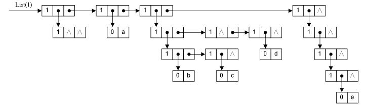      
>      
> (2) deep = 4.      
>       
> 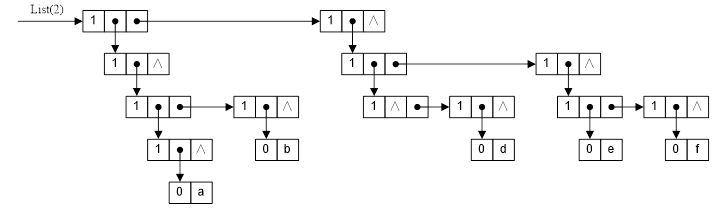      

### 5.13 已知以下各图为广义表的存储结构图，其结点结构和5.12题相同。写出各图表示的广义表。

(1) 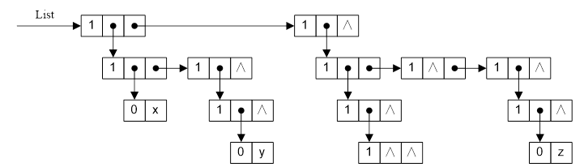     

> 广义表：((x,(y)),(((())),(),(z)))      

(2) 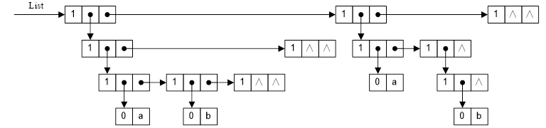     

> 广义表：(((a,b,()),()),(a,(b)),())      

### 5.14 已知等差数列的第一项为a1，公差为d，试写出该数列前n项的和S(n)(n≥1)的递归定义。

> 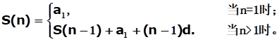      

### 5.15 写出求给定集合的幂集的递归定义。

> (1) 幂集递归定义的文字表述：（假设集合A中并无重复元素）       
>> ① 若A为Ø，则其幂集B为{Ø}。       
>> ② 若A不为Ø。取出A中第一个元素记作a，求取A\{a}的幂集C。对于C中的每个元素x{此处元素必为集合}，求集合{a}与集合x的并集，并将求得的各个并集暂时存放到集合D(D初始化为空集)中。最后，求取C与D的并集即可得到A的幂集B。      
>       
> 标记求取集合A的幂集的函数为P【A】，获取集合A的元素的函数为I【A】，加号“+”代表取并集，箭头“←”代表将右边的元素添加到左边的集合中，则求幂集的过程可简化为三步：      
> ❶ C = P【A\{a}】；      
> ❷ ∑(D←(I【C】+{a}))；      
> ❸ B = C + D。      
>    
> 例：集合 A={a,b,c} 的幂集为：B={Ø,{a},{b},{c},{a,b},{a,c},{b,c},{a,b,c}}      
> 求取过程：（递归）      
> ⒈ P【Ø】 = {Ø};      
> ⒉ P【{c}】：      
>> ❶ C = P【{c}\{c}】 = P【Ø】 = {Ø};    
>>    
>> ❷ ∑(D←(I【C】+{c})) (C中有1个元素，故需累计添加1次元素到D)    
>>> Ⅰ. D←(Ø+{c})= D←{c}，此时：D={{c}}    
>>    
>> ❸ B = C + D = {Ø,{c}}，即P【{c}】 = {Ø,{c}}。    
>>    
> ⒊ P【{b,c}】：    
>> ❶ C = P【{b,c}\{b}】 = P【{c}】 = {Ø,{c}};    
>>     
>> ❷ ∑(D←(I【C】+{b})) (C中有2个元素，故需累计添加2次元素到D)    
>>> Ⅰ. D←(Ø+{b})= D←{b}，此时：D={{b}}    
>>> Ⅱ. D←({c}+{b})= D←{b,c}，此时：D={{b},{b,c}}    
>>     
>> ❸ B = C + D = {Ø,{b},{c},{b,c}}，即P【{b,c}】 = {Ø,{b},{c},{b,c}}。    
>>     
> ⒋ P【{a,b,c}】：    
>> ❶ C = P【{a,b,c}\{a}】 = P【{b,c}】 = {Ø,{b},{c},{b,c}};    
>>    
>> ❷ ∑(D←(I【C】+{a})) (C中有4个元素，故需累计添加4次元素到D)    
>>> Ⅰ.D←(Ø+{a}) = D←{a}，此时：D={{a}}    
>>> Ⅱ.D←({b}+{a}) = D←{a,b}，此时：D={{a},{a,b}}    
>>> Ⅲ.D←({c}+{a}) = D←{a,c}，此时：D={{a},{a,b},{a,c}}    
>>> Ⅳ.D←({b,c}+{a}) = D←{a,b,c}，此时：D={{a},{a,b},{a,c},{a,b,c}}    
>>     
>> ❸ B = C + D = {Ø,{a},{b},{c},{a,b},{a,c},{b,c},{a,b,c}}    
>>> 即P【{a,b,c}】 = {Ø,{a},{b},{c},{a,b},{a,c},{b,c},{a,b,c}}。    
>    
> (2) 幂集递归定义的函数表示：（假设集合A中并无重复元素）
> 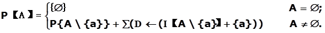      
> 其中，P【】、I【】、“+”、“←”的含义同上。      

### 5.16 试利用C语言中的增量运算“++”和减量运算“--”写出两个非负整数a和b相加的递归定义。

> 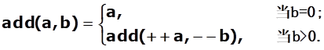      

### 5.17 已知顺序表L含有n个整数，试分别以函数形式写出下列运算的递归算法：
###### (1) 求表中的最大整数；
###### (2) 求表中的最小整数；
###### (3) 求表中n个整数之和；
###### (4) 求表中n个整数之积；
###### (5) 求表中n个整数的平均值。

----------

## 二、算法设计题

### 5.18 设计一个算法，将数组An中的元素A[0]至A[n-1]循环右移k位，并要求只用一个元素大小的附加存储，元素移动或交换次数为O(n)。

----------

### 5.19 若矩阵Am×n中的某个元素aij是第i行中的最小值，同时又是第j列中的最大值，则称此元素为该矩阵中的一个马鞍点。假设二维数组存储矩阵Am×n，试编写求出矩阵中所有马鞍点的算法，并分析你的算法在最坏情况下的时间复杂度。

----------

### 5.20 类似于以一维数组表示一元多项式，以m维数组：（aj1j2…jm），0≤ji≤n，i=1，2，…，m，表示m元多项式，数组元素ae1e2…em表示多项式中x1e1x2e2…xmem的系数。例如，和二元多项式x2+3xy+4y2-x+2相应的二维数组为：

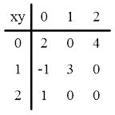    

### 试编写一个算法将m维数组表示的m元多项式以常规表示的形式（按降幂顺序）输出。可将其中一项ckx1e1x2e2…xmem印成ckx1Ee1x2Ee2…xmEem（其中m，ck和ej（j=1，2，…，m）印出它们具体的值），当ck或ej（j=1，2，…，m）为1时，ck的值或“E”和ej的值可省略不印。

----------

### 5.21 假设稀疏矩阵A和B均以三元组顺序表作为存储结构。试写出矩阵相加的算法，另设三元组表C存放结果矩阵。

----------

### 5.22 假设稀疏矩阵A和B均以三元组顺序表作为存储结构。试写出满足以下条件的矩阵相加的算法：假设三元组顺序表A的空间足够大，将矩阵B加到矩阵A上，不增加A，B之外的附加空间，你的算法能否达到O(m+n)的时间复杂度？其中m和n分别为A，B矩阵中非零元的数目。

----------

### 5.23 三元组顺序表的一种变型是，从三元组顺序表中去掉行下标域得到二元组顺序表，另设一个行起始向量，其每个分量是二元组顺序表的一个下标值，指示该行中第一个非零元素在二元组顺序表中的起始位置。试编写一个算法，由矩阵元素的下标值i，j求矩阵元素。试讨论这种方法和三元组顺序表相比有什么优缺点。

----------

### 5.24 三元组顺序表的另一种变型是，不存矩阵元素的行、列下标，而存非零元在矩阵中以行为主序时排列的顺序号，即在LOC(0, 0)=1，l=1时按教科书5.2节中公式(5-2)计算出的值。试写一算法，由矩阵元素的下标值i，j求元素的值。

----------

### 5.25 若将稀疏矩阵A的非零元素以行序为主序的顺序存于一维数组V中，并用二维数组B表示A中的相应元素是否为零元素（以0和1分别表示零元素和非零元素）。
### 例如，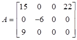可用V=(15, 22, -6, 9)和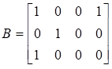表示。
### 试写一算法，实现在上述表示法中实现矩阵相加的运算。并分析你算法的时间复杂度。

----------

### 5.26 试编写一个以三元组形式输出用十字链表表示的稀疏矩阵中非零元素及其下标的算法。

----------

### 5.27 试按教科书5.3.2节中定义的十字链表存储表示编写将稀疏矩阵B加到稀疏矩阵A上的算法。

----------

### 5.28 采用教科书5.6节中给出的m元多项式的表示方法，写一个求m元多项式中第一变元的偏导数的算法。
### 5.29 采用教科书5.6节中给出的m元多项式的表示方法，写一个m元多项式相加的算法。

----------

### 5.30 试按表头、表尾的分析方法重写求广义表的深度的递归算法。

----------

### 5.31 试按教科书5.5节图5.10所示结点结构编写复制广义表的递归算法。

----------

### 5.32 试编写判别两个广义表是否相等的递归算法。

----------

### 5.33 试编写递归算法，输出广义表中所有原子项及其所在层次。

----------

### 5.34 试编写递归算法，逆转广义表中的数据元素。例如：将广义表(a, ((b, c), ()), (((d), e), f))逆转为：((f, (e, (d))), ((), (c, b)), a)。

----------

### 5.35 假设广义表按如下形式的字符串表示：(a1, a2, …, an)， n≥0，其中ai或为单字母表示的原子，或为广义表；n=0时为只含空格字符的空表( )。试按教科书5.5节图5.8所示链表结点结构编写，按照读入的一个广义表字符串建立其存储结构的递归算法。

### 5.36 试按教科书5.5节图5.8所示存储结构，编写按上题描述的格式输出广义表的递归算法。

----------

### 5.37 试编写递归算法，删除广义表中所有值等于x的原子项。

----------

### 5.38 试编写算法，依次从左至右输出广义表中第l层的原子项。例如：广义表(a, (b, (c)), (d))中的a为第一层的原子项；b和d为第二层的原子项；c为第三层的原子项。

----------
