# 第7章 图

## 一、基础知识题

### 7.1 已知如下图所示的有向图：

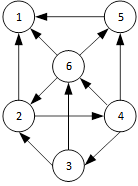

##### 请给出该图的：
##### (1)每个顶点的入/出度；
##### (2)邻接矩阵；
##### (3)邻接表；
##### (4)逆邻接表；
##### (5)强连通分量。

> (1) 各顶点入度/出度如下：    
> In(1) = 3　　Out(1) = 0    
> In(2) = 2　　Out(2) = 2    
> In(3) = 1　　Out(3) = 2    
> In(4) = 1　　Out(4) = 3    
> In(5) = 2　　Out(5) = 1    
> In(6) = 2　　Out(6) = 3    

> (2) 

>(3) 

> (4) 

> (5) 三个强连通分量    
>    
>     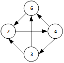


### 7.2 已知有向图的邻接矩阵为A<sub>n×n</sub>，试问每一个A<sup>(k)</sup><sub>n×n</sub>(k=1,2,…,n)各具有何种实际含义?

> 任取一对顶点<i, j>，A<sup>(k)</sup><i, j>=0代表从**i**顶点经过**k**步无法绕回**j**顶点，A<sup>(k)</sup><i, j>=x(x!=0)代表从**i**顶点经过**k**步可以绕回**j**顶点，且有**x**种路线可选。    
> 简单地说，A<sup>(k)</sup><i, j>代表由**i**到**j**的长度为**k**的路径数。    

### 7.3 画出下图所示的无向图的邻接多重表，使得其中每个无向边结点中第一个顶点号小于第二个顶点号，且每个顶点的各邻接边的链接顺序，为它所邻接到的顶点序号由小到大的顺序。列出深度优先和广度优先搜索遍历该图所得顶点序列和边的序列。


> 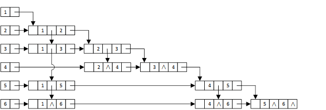

> 深度优先搜索：1->2->3->4->5->6    
> 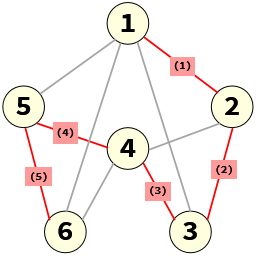

> 广度优先搜索：1->2->3->5->6->4    
> 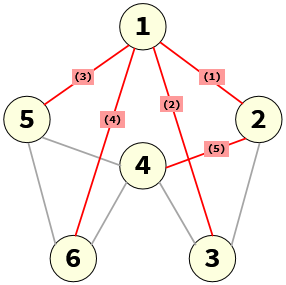

### 7.4 试对以下所示的无向图，画出其广度优先生成森林。


> 广度优先生成森林：    
> 

### 7.5 已知以二维数组表示的图的邻接矩阵如下图所示。试分别画出自顶点1出发进行遍历所得的深度优先生成树和广度优先生成树。

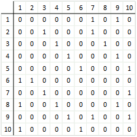

> 深度优先生成树：
> 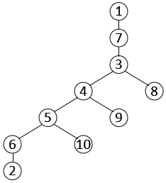

> 广度优先生成树
> 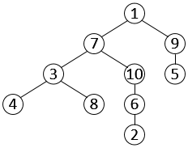

### 7.6 试证明教科书7.4.2节中求强连通分量的算法（深度优先搜索）的正确性。

> 暂未想到合适的证明过程。如有好的方案，欢迎在github提交[Issues](https://github.com/kangjianwei/Data-Structure/issues)。   

### 7.7 请对下图的无向带权图：


##### (1)写出它的邻接矩阵，并按普里姆算法求其最小生成树；

>   

##### (2)写出它的邻接表，并按克鲁斯卡尔算法求其最小生成树。

>   

### 7.8 试对以下所示无向图执行求关节点的算法，分别求出每个顶点的visited[i]和low[i]值，i=1,2, …,vexnum。


> 假设从v1开始进行深度优先搜索：    
>     
> 

### 7.9 试列出下图中全部可能的拓扑有序序列，并指出应用7.5.1节中算法Topological Sort求得的是哪一个序列（注意：应先确定其存储结构）。


> 所有可能的拓扑序列如下：    
>    
> 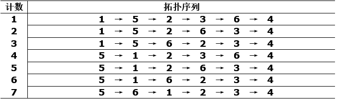
>     
> 用邻接表存储结构存储上述有向图，则7.5.1节中算法Topological Sort求得的是第7个序列。    

### 7.10 对于下图所示的AOE网络，计算各活动弧的e(a<sub>i</sub>)和l(a<sub>j</sub>)函数值、各事件(顶点)的ve(v<sub>i</sub>)和vl(v<sub>j</sub>)函数值；列出各条关键路径。

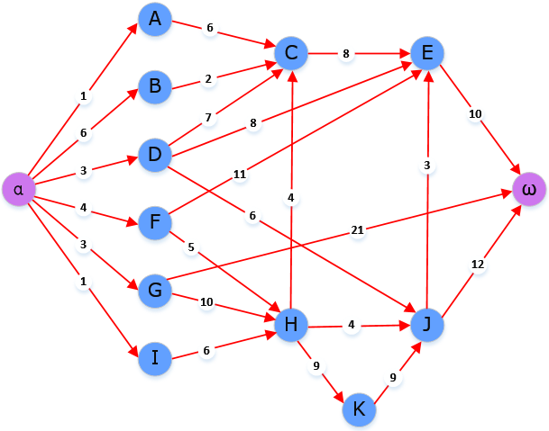

> 事件最早发生时间ve(v<sub>i</sub>)和最晚发生时间vl(v<sub>j</sub>)：    
> 

> 活动最早允许开始的时间e(a<sub>i</sub>)和最迟允许开始的时间l(a<sub>j</sub>)：    
> 

> 关键路径只有一条：α → G → H → K → J → E →ω

### 7.11 试利用Dijkstra算法求下图中从顶点a到其他各顶点间的最短路径，写出执行算法过程中各步的状态。

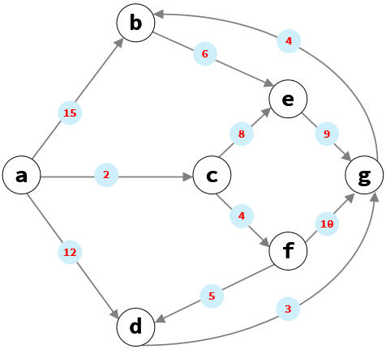

> 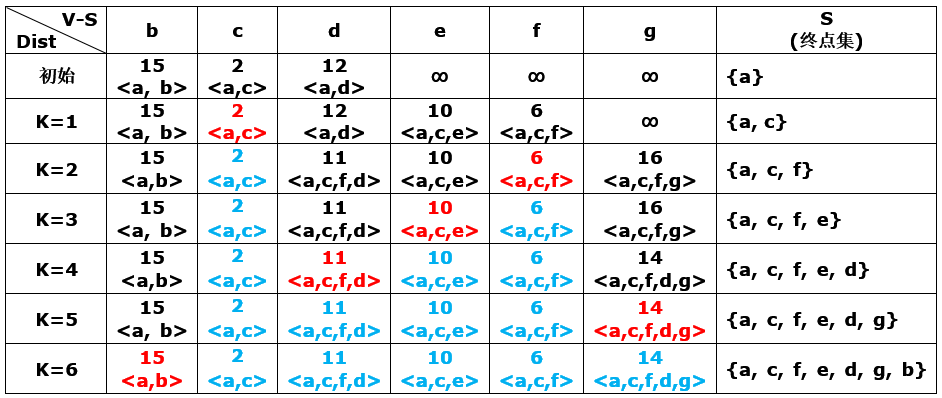

### 7.12 试证明求最短路径的Dijkstra算法的正确性。

> 暂未想到合适的证明过程。如有好的方案，欢迎提交[Issues](https://github.com/kangjianwei/Data-Structure/issues)。   

### 7.13 试利用Floyd算法求下图所示有向图中各对顶点之间的最短路径。

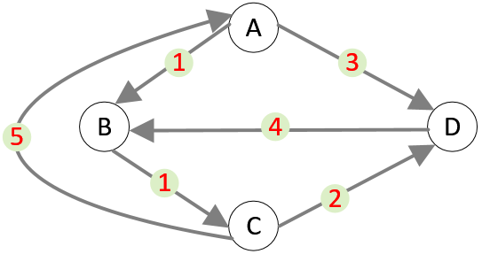

> 步骤如下：    

> 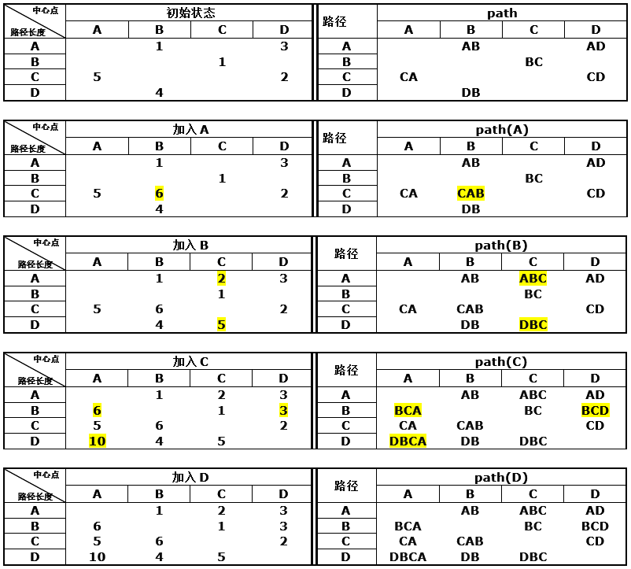


## 二、算法设计题

### 7.15 试在邻接矩阵存储结构上实现图的基本操作:InsertVex(G,v)，InsertArc(G,v,w)，DeleteVex(G,v)和DeleteArc(G,v,w)。

----------

### 7.14 编写算法，由依次输入的顶点数目、弧的数目、各顶点的信息和各条弧的信息建立有向图的邻接表。

### 7.16 试对邻接表存储结构重做7.15题。

----------

### 7.17 试对十字链表存储结构重做7.15题。

----------

### 7.19 编写算法，由依次输入的顶点数目、边的数目、各顶点的信息和各条边的信息建立无向图的邻接多重表。
### 7.18 试对邻接多重表存储结构重做7.15题。

----------

### 7.20 下面的算法段可以测定图G=(V,E)是否可传递：

```c
trans = TRUE;
for(V中的每个x)
  for(N(x)中的每个y)
    for(N(y)中不等于x的每个z)
      if(z不在N(x)中)
        trans = FALSE;
```

##### 其中N(x)表示x邻接到的所有顶点的集合。试以邻接矩阵存储结构实现判定一个图的可传递性的算法，并通过n=|V|，m=|E|和d=结点度数的均值，估计执行时间。

----------

### 7.21 试对邻接表存储结构重做7.20题。

----------

### 7.22 试基于图的深度优先搜索策略写一算法，判别以邻接表方式存储的有向图中是否存在由顶点vi到顶点vj的路径(i≠j)。注意：算法中涉及的图的基本操作必须在此存储结构上实现。
### 7.23 同7.22题要求。试基于图的广度优先搜索策略写一算法。

----------

### 7.24 试利用栈的基本操作编写，按深度优先搜索策略遍历一个强连通图的非递归形式的算法。算法中不规定具体的存储结构，而将图Graph看成是一种抽象的数据类型。

----------

### 7.25 假设对有向图中n个顶点进行自然编号，并以三个数组s[1…max],fst[1…n]和lst[1…n]表示之。其中数组s存放每个顶点的后继顶点的信息，第i个顶点的后继顶点存放在s中下标从fst[i]起到lst[i]的分量中(i=1,2,…,n)。若fst[i]>lst[i]，则第i个顶点无后继顶点。试编写判别该有向图中是否存在回路的算法。

----------

### 7.26 试证明，对有向图中顶点适当地编号，可使其邻接矩阵为下三角形且主对角线为全零的充要条件是：该有向图不含回路。然后写一算法对无环有向图的顶点重新编号，使其邻接矩阵变为下三角形，并输出新旧编号对照表。

```
证明：
1. 证明必要性：（使用反证法）
   假设有向图中存在回路va->vb->vc->...->vz，则对a、b、c...调整顺序后，该回路一定可以被表示为vn->v(n-1)->v(n-2)->...->v1->vn，其中，a、b、c、1、2、3...均表示顶点的序号。
   由该回路可知，最终一定存在一条边为vi->vj，且i<j，例如上面的v1->vn。
   显然，i<j的边是无法保存到邻接矩阵的下三角的。
   因此，对有向图中顶点适当地编号，可使其邻接矩阵为下三角形且主对角线为全零的必要条件是该有向图不含回路。
2. 证明充分性：（使用反证法）
   假设当前的顶点集无论如何调整顺序，其邻接矩阵的上三角区至少包含一条边的信息。
   即此时至少存在一条边为vi->vj，且i<j。
   因为根据对称性，vi->vj总是可以调整为vj->vi，但此时如果无法调整，则说明下三角区已经存在了一条边为vj->vi。
   此时，既存在vi->vj，也存在vj->vi，那么顶点i与顶点j将形成回路，这与题设的"该有向图不含回路"相矛盾。
   因此，假设不成立，即当有向图不含回路时，总可以对有向图中顶点适当地编号，以使其邻接矩阵为下三角形且主对角线为全零。
```

----------

### 7.27 采用邻接表存储结构，编写一个判别无向图中任意给定的两个顶点之间是否存在一条长度为k的简单路径的算法（一条路径为简单路径指的是其顶点序列中不含有重现的顶点)。

----------

### 7.28 已知有向图和图中两个顶点u和v，试编写算法求有向图中从u到v的所有简单路径，并以下图为例手工执行你的算法，画出相应的搜索过程图。


----------

### 7.29 试写一个算法，在以邻接矩阵方式存储的有向图G中求顶点i到顶点j的不含回路的、长度为k的路径数。

----------

### 7.30 试写一个求有向图G中所有简单回路的算法。

----------

### 7.31 试完成求有向图的强连通分量的算法，并分析算法的时间复杂度。

----------

### 7.32 试修改普里姆算法，使之能在邻接表存储结构上实现求图的最小生成森林，并分析其时间复杂度（森林的存储结构为孩子-兄弟链表）。

----------

### 7.33 已知无向图的边集存放在某个类型为EdgeSetType的数据结构EdgeSet中（没有端点相重的环边），并在此结构上已定义两种基本运算:
##### (1) 函数GetMinEdge(EdgeSet, u, v)：若EdgeSet非空，则必存在最小边，变参u和v分别含最小边上两顶点，并返回true；否则返回false；
##### (2) 过程DelMinEdge(EdgeSet, u, v)：从EdgeSet中删除依附于顶点u和v的最小边。
##### 试在上述结构上实现求最小生成树（以孩子-兄弟链表表示）的克鲁斯卡尔算法。

----------

### 7.34 试编写一个算法，给有向无环图G中每个顶点赋以一个整数序号，并满足以下条件：若从顶点i至顶点j有一条弧，则应使i<j。

----------

### 7.35 若在DAG(有向无环图)图中存在一个顶点r，在r和图中所有其他顶点之间均存在由r出发的有向路径，则称该DAG图有根。试编写求DAG图的根的算法。

----------

### 7.36 在图的邻接表存储结构中，为每个顶点增加一个MPL域。试写一算法，求有向无环图G的每个顶点出发的最长路径的长度，并存入其MPL域。请给出算法的时间复杂度。
### 7.37 试设计一个求有向无环图中最长路径的算法，并估计其时间复杂度。

----------

### 7.38 一个四则运算算术表达式以有向无环图的邻接表方式存储，每个操作数原子都由单个字母表示。写一个算法输出其逆波兰表达式。

----------

### 7.39 把存储结构改为二叉链表，重做7.38题。

----------

### 7.40 若7.38题的运算符和操作数原子分别由字符和整数表示，请设计邻接表的结点类型，并且写一个表达式求值的算法。

----------

### 7.41 试编写利用深度优先遍历有向图实现求关键路径(CPM)的算法。

----------

### 7.42 以邻接表作存储结构实现求从源点到其余各顶点的最短路径的Dijkstra算法。

----------
